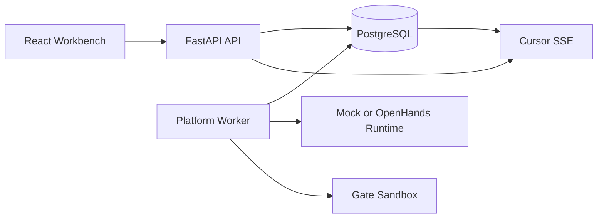

# Architecture

## 领域不变量

1. Node Asset 是复用定义，Flow Node 是一次画布放置；同一资产可重复放置。
2. 边只表达候选产物映射；节点就绪只依赖显式 Input Binding 和类型，不依赖上游状态。
3. Flow Run 启动产生 Snapshot v1；同步只追加 v2/v3，旧 Attempt 始终引用旧 Snapshot。
4. Node Run 是逻辑运行，修订创建新 Attempt；Artifact Version、Binding、Gate Evaluation、Human Action 和 Event 只追加。
5. START 门禁全部通过后仍等待人工开始；END 门禁全部通过后仍等待人工验收。
6. Runtime 不获得 Human Token、数据库凭据或密钥解密能力。

核心表：`node_assets`、`node_io_fields`、`node_capability_refs`、`model_providers`、`flow_nodes`、`flow_edges`、`gate_policies`、`flow_runs`、`run_snapshots`、`node_runs`、`node_attempts`、`artifact_versions`、`attempt_input_bindings`、`gate_evaluations`、`human_actions`、`background_tasks` 和 `run_events`。
