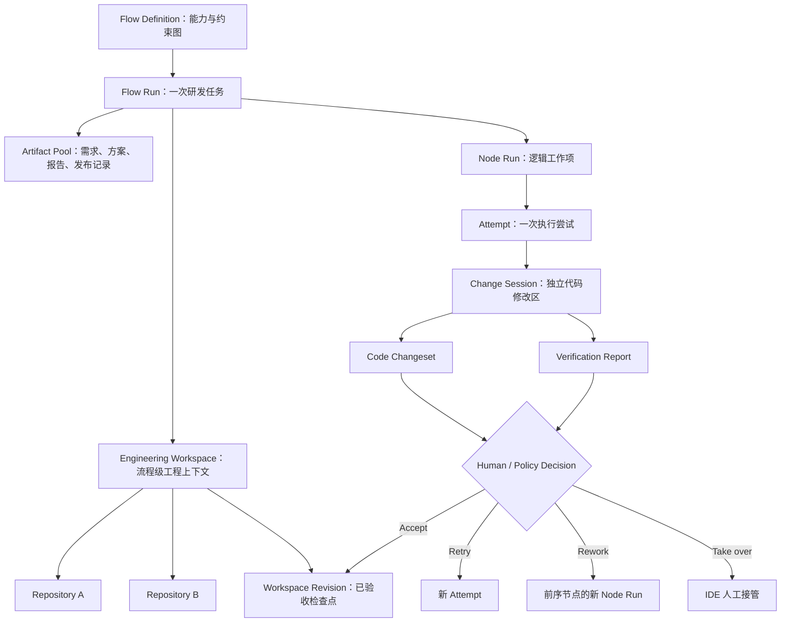

# FlowWeave 工程工作空间与自主研发流程产品设计

> 文档状态：产品顶层设计草案
>
> 设计范围：从“Agent 根据技术方案编写代码”的近期闭环，演进到“需求—设计—编码—验证—发布”的自主研发流程
>
> 本文只定义产品概念、用户体验、运行规则和阶段边界，不作为数据库、接口或部署实现规格。

## 1. 产品结论

FlowWeave 应在现有“节点 + 产物 + Attempt”模型之上增加一个一等领域对象：**工程工作空间（Engineering Workspace）**。每个 Flow Run 拥有一个独立工程工作空间，一个工作空间可以包含多个代码仓库；同一 Flow Run 中的多个节点共享该工作空间的工程上下文和已验收代码版本，不同 Flow Run 之间严格隔离。

工作空间中的代码保存在宿主机受管目录，并映射到 Agent Runtime。Agent 容器可以被销毁和重建，工程代码、变更、验证报告和审计历史仍然存在。用户可以从运行工作台获得宿主机路径或远程 IDE 连接入口，直接审查、调试或接管 Agent 生成的代码。

“共享工作空间”不应等于“所有节点并发写同一目录”。产品应区分：

- **流程级集成视图**：保存当前已验收、可供后续节点使用的多仓库代码状态。
- **Attempt 变更会话**：一次编码尝试的独立修改区，基于某个明确的工作空间版本创建。
- **工作空间版本**：一次变更被验收后形成的不可变检查点，后续节点从该版本继续工作。

近期版本可以通过“同一时间只允许一个写入者”的方式降低实现复杂度；长期应使用每个 Attempt 独立的 Git worktree/分支，并在验收后集成到流程级视图。这样既满足跨节点共享，又避免失败 Attempt、并行节点和人工修改相互污染。

## 2. 背景与目标

### 2.1 当前基础

FlowWeave 已具备节点资产、流程快照、Node Run/Attempt、Artifact Version、输入绑定、Gate、Agent Runtime、Sandbox 和人工验收机制。代码仓库可以由 Skill 根据仓库名拉取，Agent Runtime 也具备终端和文件编辑能力。

当前缺口不是“Agent 能否执行 Git 或修改文件”，而是平台尚未把以下内容作为产品中的正式对象：

- 一次研发任务涉及的多仓库工程上下文；
- 不同流程运行之间的代码隔离；
- 多个节点之间如何连续消费前序代码变更；
- 一次 Attempt 究竟修改了什么；
- 测试、构建和静态检查能否证明代码可用；
- 人工如何通过 IDE 审查和接管；
- Agent 如何基于验证结果重试、回退或推进；
- 何时允许产生提交、PR、部署等外部副作用。

### 2.2 近期目标

让 Agent 能够根据已确认的技术方案，在一个流程级、多仓库、宿主机持久化的工程工作空间中完成代码编写，并交付可供人工验收的代码变更与验证证据。

近期闭环为：

```text
技术方案 + 仓库名
  → 准备流程工程工作空间
  → 拉取并识别一个或多个仓库
  → Agent 编写代码
  → 平台执行验证
  → 用户查看 Diff / 报告或用 IDE 接管
  → 接受形成工作空间新版本，或驳回后重做
```

### 2.3 长期目标

让 Agent 在平台策略约束下，围绕版本化产物自主完成：

```text
需求理解
  → 需求澄清与拆解
  → 技术方案制定与评审
  → 识别和准备代码仓库
  → 多仓库代码实现
  → 自动测试与质量评估
  → 代码评审与修复
  → 创建变更请求 / PR
  → 发布审批与部署
  → 上线验证、监控与必要时回滚
```

流程不以固定线性顺序为唯一运行方式。Agent 可以根据产物和验证结果提出重试当前节点、回到前序节点重新产出、增加新的验证节点或请求人工接管；平台控制器负责根据权限、预算、证据和风险策略决定是否执行。

### 2.4 本阶段非目标

近期产品不承诺：

- Agent 自动合并受保护分支；
- Agent 无审批发布生产环境；
- 多个 Agent 无冲突地同时修改同一仓库；
- 用大模型判断替代测试、构建和安全门禁；
- 把流程工作空间当作长期开发环境永久保存；
- 自动解决所有跨仓库版本、依赖和发布顺序问题。

## 3. 产品设计原则

### 3.1 节点负责能力，产物承载状态

节点表达“要完成什么”和“具备什么能力”；流程的真实状态由已验收产物、工作空间版本和决策记录构成。对话和 Agent 最终消息只属于执行过程，不应成为代码交付的唯一依据。

### 3.2 流程级共享，运行间隔离

同一 Flow Run 的节点共享仓库集合、工程配置和已验收代码；不同 Flow Run 即使处理同一个仓库，也不能共享可写工作目录、分支或未验收变更。

### 3.3 容器是执行环境，宿主机是持久化边界

Runtime 只挂载当前 Flow Run 的受管工作空间。容器销毁不影响代码；容器也不能访问其他 Flow Run 的工作空间。

### 3.4 共享的是版本，不是无约束的可变目录

后续节点默认读取前序节点已验收的工作空间版本。未验收 Attempt 的变更不能自动成为其他节点的输入。所有写操作都必须归属某个 Attempt 或明确的人工接管会话。

### 3.5 验收代码必须验收证据

代码节点的正式输出至少包含变更集、基线版本、结果版本和验证报告。单纯输出“代码已完成”不能进入正式产物池。

### 3.6 外部副作用晚绑定

本地修改、测试和评审可以在工作空间中反复执行；Push、创建 PR、合并、发布和回滚属于不同等级的外部动作，必须由独立策略授权。

### 3.7 自动化必须有限、有据、可停止

Agent 可以提出下一步，但不能绕过平台状态机、预算和权限。每次自动重试或回退都必须引用失败证据，并受次数、时间、成本和无进展检测约束。

## 4. 顶层产品结构



## 5. 核心产品对象

### 5.1 Engineering Workspace

工程工作空间是一个 Flow Run 的多仓库工程容器，也是编码节点共享上下文的边界。

核心属性：

- 所属 Flow Run；
- 工作空间名称和宿主机受管路径；
- 生命周期状态；
- 仓库清单；
- 当前已验收 Workspace Revision；
- 工具链与环境提示；
- 当前写入租约；
- 保留期限和归档策略；
- IDE 访问状态；
- 空间占用、最后活动时间和健康状态。

建议生命周期：

```text
NOT_CREATED → PREPARING → READY → ACTIVE → ARCHIVED → DELETING → DELETED
                    ↘ PREPARATION_FAILED
```

- `PREPARING`：创建目录、准备仓库、解析基础版本。
- `READY`：仓库清单有效，可启动编码 Attempt。
- `ACTIVE`：存在 Agent 或人工会话正在使用。
- `ARCHIVED`：Run 已结束，默认只读，等待保留期结束。
- `PREPARATION_FAILED`：保留诊断信息，允许重新准备。

### 5.2 Repository Resource

Repository Resource 表示工作空间中的一个仓库实例，而不是全局 Git 项目的永久副本。仓库名由流程输入或技术方案给出，拉取动作可以继续由 Skill 完成。

每个仓库至少记录：

- `repository_name`：业务可识别的仓库名；
- `alias`：工作空间内稳定且唯一的目录名；
- `remote_url`：Skill 解析出的真实地址；
- `default_branch` 与 `base_revision`；
- `current_revision`：当前流程集成视图的版本；
- `credential_profile`：使用哪个受管凭据能力，只记录引用；
- `status`：待拉取、拉取中、可用、失败、冲突、已移除；
- `source`：流程输入、Agent 发现、人工添加；
- `role`：主要实现仓库、依赖仓库、测试仓库、基础设施仓库等；
- `read_only`：是否禁止修改。

同一流程可以动态补充仓库。例如技术方案只提供主仓库，Agent 在分析依赖后提出新增另一个仓库；平台应把它作为“仓库变更建议”展示，获得策略许可或人工确认后再拉取。

### 5.3 Workspace Revision

Workspace Revision 是整个多仓库工作空间的一次不可变逻辑检查点。它不要求把所有仓库内容复制一份，而是保存一个多仓库版本清单：

```json
{
  "revision_no": 4,
  "repositories": {
    "order-service": {"commit": "abc123", "tree_hash": "..."},
    "payment-sdk": {"commit": "def456", "tree_hash": "..."}
  },
  "created_from_attempt": "...",
  "previous_revision": 3
}
```

后续节点绑定的是 Workspace Revision，而不是“当前目录大概是什么状态”。如果一次 Attempt 只修改其中一个仓库，新 Revision 仍然完整记录所有仓库的版本。

### 5.4 Change Session

Change Session 是一次 Attempt 的代码修改边界。它记录：

- 基于哪个 Workspace Revision 创建；
- 允许读写哪些仓库和路径；
- 对应的临时分支/worktree；
- Agent 和人工分别何时持有写入权；
- 当前变更文件、未跟踪文件和冲突；
- 验证使用的代码版本；
- 最终被接受、驳回、丢弃或保留调查。

建议状态：

```text
PREPARING → READY → AGENT_EDITING → VERIFYING → REVIEWING
                                      ↓             ↓
                                    FAILED       ACCEPTED
                                      ↓             ↓
                                  RETRYABLE      INTEGRATED

任意非终态 → HUMAN_TAKEOVER → REVIEWING
任意非终态 → CANCELLED
```

### 5.5 Code Changeset

Code Changeset 是编码节点的核心产物，至少包含：

- 涉及的仓库；
- 每个仓库的 base revision 和 result revision/tree hash；
- 文件新增、修改、删除、重命名清单；
- 统一 Diff 或可读取 Diff 的存储引用；
- 变更规模统计；
- Agent 实现摘要；
- 与技术方案条目的追踪关系；
- 是否包含生成文件、二进制文件、依赖锁文件；
- 潜在风险和未解决事项。

Code Changeset 必须由平台从工作区重新计算，不能直接相信 Agent 自报。

### 5.6 Verification Report

Verification Report 是对某个精确 Workspace Revision 或 Change Session 的验证结果，包含：

- 验证目标版本；
- 命令、工作目录、环境版本和超时；
- 退出码、耗时、日志引用；
- 单测/集成测试统计；
- lint、类型检查、构建、安全扫描结果；
- 必需检查是否全部通过；
- 失败指纹；
- 是否可重试及建议修复范围。

确定性结果由平台采集；Agent 可以补充语义解释，但不能篡改原始结果。

### 5.7 Execution Decision

Execution Decision 表示基于产物与证据得出的下一步建议和平台裁决。主要类型为：

- `ACCEPT_AND_CONTINUE`：接受当前产物并进入下一目标；
- `RETRY_CURRENT`：创建同一 Node Run 的新 Attempt；
- `REWORK_NODE`：针对前序节点创建新的逻辑工作项；
- `ADD_REPOSITORY`：补充工作空间仓库；
- `ADD_VALIDATION`：增加验证节点或验证项；
- `REQUEST_INPUT`：缺少业务或技术输入；
- `HUMAN_TAKEOVER`：暂停 Agent，由用户接管；
- `CREATE_CHANGE_REQUEST`：创建 PR/MR 等外部变更请求；
- `RELEASE`：进入发布动作；
- `ABORT`：结束本次 Run。

Decision 包含提出者、置信度、原因、引用证据、目标节点/仓库、预算影响和策略裁决。Agent 只能提出，平台或人工负责批准与执行。

## 6. 工程工作空间设计

### 6.1 隔离层级

产品采用三层隔离：

| 层级 | 隔离对象 | 共享范围 | 目的 |
|---|---|---|---|
| Flow Run | Engineering Workspace | 同一 Run 的全部节点 | 隔离不同需求、不同运行和未发布代码 |
| Attempt | Change Session | 当前 Attempt 和其人工接管者 | 隔离失败重试、并行修改和未验收变更 |
| Runtime | Sandbox | 当前 Agent 会话 | 隔离执行工具、进程、网络和资源配额 |

Runtime 被销毁后，前两层仍然存在。

### 6.2 宿主机目录模型

以下是产品语义示例，最终路径可配置：

```text
<workspace-root>/flow-runs/<flow-run-id>/
├── integration/                  # 当前已验收的多仓库集成视图，IDE 默认打开
│   ├── order-service/
│   └── payment-sdk/
├── attempts/
│   └── <attempt-id>/
│       ├── repositories/         # 本 Attempt 的独立 worktree/变更区
│       │   ├── order-service/
│       │   └── payment-sdk/
│       └── reports/              # 测试、构建、扫描的原始输出
├── shared/                       # 经明确声明的跨节点非代码文件
├── artifacts/                    # Diff、manifest、导出报告等平台产物
└── .flowweave/                   # 平台元数据，Agent 与 IDE 默认只读
    ├── workspace.json
    ├── repositories.json
    └── revisions/
```

设计要求：

- Runtime 只能挂载所属 Flow Run 的目录；
- 默认工作目录是本 Attempt 的 `repositories`，不是 `integration`；
- 后续节点从最新已验收 Revision 创建自己的 Change Session；
- `integration` 只由平台集成动作更新，Agent 不直接写；
- IDE 审查默认打开 Attempt 变更区；查看全局当前状态时打开 `integration`；
- 平台元数据不能由 Agent 或普通 IDE 写入；
- 路径中不使用用户提供的原始仓库名直接拼接，必须生成安全 alias；
- 符号链接不能逃逸 Flow Run 根目录。

### 6.3 为什么不直接让所有节点写同一个目录

所有节点共享一个可写目录虽然实现简单，但会产生以下产品问题：

- 驳回 Attempt 后无法判断哪些文件应该恢复；
- 两个并行 Agent 会互相覆盖；
- 人工 IDE 修改与 Agent 修改缺少所有权；
- 测试报告可能对应另一个时刻的代码；
- 后续节点可能消费尚未验收的代码；
- 无法可靠地重现某次结果；
- 跨仓库只修改了一半时，其他节点会看到不一致状态。

因此，产品上仍然是“流程级共享工作空间”，但共享通过 Workspace Revision 完成。近期若暂不实现 worktree，必须至少提供流程级独占写锁、修改前后快照和禁止并行编码节点，并把这视为过渡方案。

### 6.4 多仓库原子性

一次需求可能同时修改多个仓库。FlowWeave 应把一次多仓库变更视为一个 Change Set Group：

- 各仓库分别产生 Changeset；
- 所有 Changeset 共享一个 Attempt 和技术目标；
- 验证报告明确指出是单仓验证还是跨仓集成验证；
- 人工可以整体接受，也可以要求拆分；
- 默认不支持“只接受其中一半并悄悄继续”；
- 若确需部分接受，平台创建新的 Workspace Revision，并把未接受部分转成新的 Rework 工作项；
- 创建多个 PR 时，记录 PR 依赖和推荐合并顺序。

Git 本身不能提供跨仓库事务，因此这里的“原子”是 FlowWeave 业务状态原子：只有所有必需仓库的变更与验证都满足条件，当前研发目标才被标记完成。

### 6.5 仓库拉取 Skill 的产品契约

现阶段继续复用仓库拉取 Skill，但应定义标准输入输出，避免 Agent 随意克隆到未知路径。

输入：

```json
{
  "repository_name": "order-service",
  "destination_alias": "order-service",
  "requested_ref": "main",
  "workspace_id": "..."
}
```

Skill 负责：

- 根据仓库名解析真实 Git 地址；
- 使用环境中的受管凭据拉取；
- 将仓库放入平台分配的目标目录；
- 返回远端地址、默认分支和解析出的 commit；
- 不读取或修改其他 Flow Run 的目录；
- 不在消息、产物或日志中返回凭据。

平台负责：

- 分配并校验目标目录；
- 校验结果确实为 Git 仓库；
- 重新读取 remote、branch、commit 和 tree hash；
- 把结果登记为 Repository Resource；
- 记录 Skill 执行证据和失败原因；
- 决定是否允许新增计划外仓库。

Skill 结果只是“拉取完成的申报”，最终仓库清单以平台验证为准。

### 6.6 缓存与隔离的兼容方案

为了避免每个 Flow Run 都从远端完整下载，可在长期引入平台只读 Git Object Cache 或 bare mirror：

```text
全局只读镜像缓存
  → 为每个 Flow Run 创建独立 clone/worktree
  → 为每个 Attempt 创建独立变更 worktree
```

缓存只共享 Git 对象，不共享工作树、分支、索引、未提交代码或凭据。缓存失效只影响性能，不能影响 Run 的版本确定性。该优化不应成为近期编码闭环的前置条件。

## 7. 编码节点产品设计

### 7.1 节点执行画像

不建议新增一套与普通节点平行的“代码节点系统”。应在节点资产上增加执行画像：

- `GENERAL_AGENT`：文档、分析和协作；
- `WORKSPACE_AGENT`：需要读取工程工作空间但默认不修改；
- `CODING_AGENT`：允许创建 Change Session 并修改代码；
- `EVALUATOR_AGENT`：评估代码和报告，默认只读；
- `RELEASE_AGENT`：执行 PR、部署、回滚等受控外部动作。

节点仍然通过输入、输出和完成定义表达业务含义。例如“实现退款接口”和“修复集成测试”都可以是 `CODING_AGENT`，但目标、输入和验证策略不同。

### 7.2 编码节点输入

建议标准输入类型：

| 输入类型 | 说明 | 是否必需 |
|---|---|---|
| `TECHNICAL_DESIGN` | 已确认技术方案及实现约束 | 近期必需 |
| `REPOSITORY_REQUESTS` | 仓库名、目标分支、仓库角色 | 近期必需 |
| `WORKSPACE_REVISION` | 本次修改基于的流程代码版本 | 系统提供 |
| `REQUIREMENT` | 原始需求与验收标准 | 建议 |
| `TASK_SCOPE` | 当前节点负责的方案条目和范围 | 必需 |
| `PREVIOUS_FEEDBACK` | 上轮评审、测试或失败证据 | 重试时必需 |
| `CONSTRAINT_SET` | 可改路径、禁止项、兼容性和安全约束 | 建议 |

### 7.3 编码节点输出

| 输出类型 | 说明 | 验收要求 |
|---|---|---|
| `CODE_CHANGESET_GROUP` | 一个或多个仓库的结构化变更 | 平台计算并与基线关联 |
| `VERIFICATION_REPORT` | 测试、构建、lint 等证据 | 必需检查有明确结果 |
| `IMPLEMENTATION_SUMMARY` | 实现方式、关键文件和权衡 | 可追踪到技术方案 |
| `OPEN_ISSUES` | 未解决问题、风险和后续事项 | 不得隐去失败项 |
| `WORKSPACE_REVISION_CANDIDATE` | 验收后可形成的新工作空间版本 | 仅平台可正式发布 |
| `DECISION_PROPOSAL` | 接受、重试或请求输入建议 | 仅为建议 |

### 7.4 完成定义

编码节点进入“待验收”前，平台至少确认：

1. 所有目标仓库仍基于声明的 base revision，或漂移已被显式处理；
2. 工作区没有无法解释的冲突；
3. 已生成完整 Changeset；
4. 必需验证均已执行，没有报告与代码版本错配；
5. Agent 给出实现摘要和未解决事项；
6. 修改未越过允许路径和仓库范围；
7. 凭据、密钥和受保护文件未进入变更；
8. 产物均已登记并可审计。

满足这些条件只表示“可以评审”，不等于自动接受。

## 8. 近期用户流程：技术方案到代码

### 8.1 启动 Run

用户从研发流程创建 Flow Run，提供：

- 任务名称；
- 技术方案文档；
- 涉及的一个或多个仓库名；
- 可选目标分支/commit；
- 验收标准；
- 本次 Run 的环境版本和自治级别。

系统创建空的 Engineering Workspace，并显示准备状态。

### 8.2 准备工程工作空间

“工程准备”节点读取仓库名，通过 Skill 拉取仓库。用户在工作台看到：

- 仓库名与解析出的远端；
- 基线分支和 commit；
- 拉取进度与失败原因；
- 仓库目录 alias；
- 是否有仓库未解析或需授权；
- 当前 Workspace Revision 0。

所有必需仓库准备成功后，工作空间进入 `READY`。

### 8.3 Agent 编码

编码节点启动时：

1. 固定本次输入的技术方案版本和 Workspace Revision；
2. 创建 Attempt Change Session；
3. 将技术方案、仓库清单、路径和验证要求注入 Agent；
4. Agent 在宿主机映射的 Attempt 目录中分析并修改多个仓库；
5. Agent 可运行允许的构建和测试命令；
6. 平台持续记录工具事件，但不把每条终端日志都当作正式产物；
7. Agent 完成后，平台冻结待验收版本并采集变更。

### 8.4 平台验证

验证策略由节点资产和仓库级配置共同决定。每项验证显示：

- 名称、命令与工作目录；
- 适用仓库；
- 是否必需；
- 状态、耗时和退出码；
- 摘要与完整日志；
- 对应的代码 hash；
- 失败是否允许 Agent 自动修复。

Agent 自己运行过的测试可以作为过程证据，但平台应在冻结变更后按策略重新运行必需验证，以避免“测试通过后代码又被修改”。

### 8.5 人工审查

编码 Attempt 的验收页默认显示：

- 技术方案条目与实现文件的对应关系；
- 按仓库组织的文件树和 Diff；
- 测试、构建、lint、类型检查摘要；
- 风险、未解决事项和越界修改；
- 多仓库依赖与建议提交顺序；
- Agent 对话和终端时间线；
- “在 IDE 中打开”“接管修改”“接受”“驳回并重试”操作。

用户接受后，平台将 Changeset 集成到流程级 `integration` 视图，生成新的 Workspace Revision，并将其作为正式产物供后续节点使用。用户驳回后，当前 Attempt 保持只读，原因成为下一 Attempt 的输入。

### 8.6 后续节点共享

后续的测试、评审或继续编码节点都基于已接受的新 Workspace Revision 创建自己的会话。它们可以看到前序节点的代码，但不会继承前序节点仍未接受的临时文件、进程和容器状态。

## 9. IDE 审查与人工接管

### 9.1 两种使用模式

**审查模式**：用户通过 IDE 打开冻结后的 Attempt Change Session，默认只读或受保护写入，用于搜索、跳转、运行本地分析和检查 Diff。

**接管模式**：用户显式暂停 Agent，获取 Change Session 的写入租约，在 IDE 中修改代码、运行命令，然后将控制权交回平台验证与验收。

不能允许 Agent 和人工同时无协调地写同一个 Change Session。

### 9.2 连接入口

工作台的“工程工作空间”页面提供：

- 本机部署：复制绝对宿主机路径、使用系统协议打开本地 IDE；
- 远程部署：生成 SSH Remote、Remote Development Gateway 或平台受控隧道入口；
- 浏览器 IDE：未来可选，不作为近期必需能力；
- 连接对象选择：`integration`、某个 Attempt、某个仓库；
- 访问模式：只读审查或写入接管；
- 连接有效期和当前持有者。

平台只生成连接信息或短期授权，不向 Agent 消息暴露宿主机凭据。远程 IDE 连接到宿主机受管目录，而不是连接即将被回收的 Agent 容器。

### 9.3 人工修改的归属

人工接管期间的修改仍属于当前 Attempt，并进入同一个 Code Changeset。平台记录：

- 接管人和时间；
- 接管前后的 tree hash；
- 人工提交的说明；
- 是否交回 Agent；
- 验证是否在人工修改后重新执行。

如果用户希望脱离当前 Attempt 自由实验，应创建新的人工 Change Session，而不是直接修改 `integration`。

## 10. 并发、锁与冲突策略

### 10.1 近期策略

近期默认采用保守模型：

- 一个 Flow Run 同时只能有一个可写编码 Attempt；
- 只读分析、评审和文档节点可以并行；
- 人工接管前必须暂停 Agent；
- 工作空间准备、集成和归档期间禁止启动新的写入 Attempt；
- 写入租约超时后由平台回收，但不能自动丢弃目录；
- 发生基线漂移时停止集成并要求重建或人工处理。

这一限制足以支持首个版本，并显著降低多仓库冲突风险。

### 10.2 长期策略

长期允许多个 Change Session 基于同一 Workspace Revision 并行，但集成时需要：

- 检测仓库和文件级重叠；
- 在隔离区尝试 rebase/merge；
- 重新运行受影响验证；
- 无冲突且策略允许时自动集成；
- 有冲突时创建冲突解决节点或请求人工；
- 集成完成后为尚未合并的会话标记基线过期。

并行执行是运行策略，不应改变 Artifact 和 Attempt 的不可变历史。

## 11. 验证与质量策略

### 11.1 验证层次

1. **工作空间完整性**：仓库存在、基线正确、无路径逃逸、磁盘可用。
2. **变更合法性**：允许路径、文件类型、Diff 大小、敏感信息、生成文件规则。
3. **仓库级验证**：lint、类型检查、单元测试、构建。
4. **跨仓库验证**：接口兼容、契约测试、组合构建、集成测试。
5. **语义评审**：需求覆盖、方案一致性、设计质量和风险。
6. **发布验证**：制品、部署前检查、冒烟测试和上线后观测。

前四层优先使用确定性工具；第五层可以由 Evaluator Agent 辅助；第六层受到更严格的环境和权限策略控制。

### 11.2 验证策略来源

验证命令可能来自：

- 节点资产预配置；
- 仓库内可信配置；
- 技术方案声明；
- Agent 建议并经确认；
- 组织级强制策略。

优先级为“组织强制策略 > Run 显式策略 > 节点策略 > 仓库可信配置 > Agent 建议”。低优先级不能关闭高优先级的必需检查。

### 11.3 失败处理

验证失败后，系统生成稳定失败指纹，并允许：

- 自动恢复当前 Coding Agent 修复；
- 创建新的 Attempt 并附带失败报告；
- 判断技术方案有误，回到方案节点；
- 判断需求不明确，请求补充输入；
- 判断环境故障，重试验证而不修改代码；
- 超过预算或重复失败后请求人工。

平台应区分“代码失败、环境失败、基础设施失败和策略拒绝”，避免 Agent 因平台故障反复修改正确代码。

## 12. 长期自主研发流程

### 12.1 参考节点集合

长期流程可以由以下可复用节点资产组成：

| 阶段 | 参考节点 | 主要产物 |
|---|---|---|
| 需求 | 需求解析、澄清、验收标准生成 | 结构化需求、待确认问题、验收标准 |
| 设计 | 现状调研、影响分析、技术方案、方案评审 | 技术方案、仓库清单、风险清单 |
| 准备 | 仓库解析、工作空间准备、任务拆分 | Workspace Revision 0、实现任务 |
| 编码 | 按任务或仓库实现、迁移、配置修改 | Changeset、实现摘要 |
| 验证 | 单测、构建、集成测试、安全扫描 | Verification Reports |
| 评审 | 代码评审、需求覆盖评估、风险评估 | Review Report、Decision |
| 交付 | 创建 PR、跟踪 CI、处理评审意见 | Change Request、CI Report |
| 发布 | 发布计划、审批、部署、冒烟测试 | Release Record、Deployment Evidence |
| 运行 | 监控观察、异常评估、回滚 | Observation Report、Rollback Record |

这些节点不是必须按一条线执行。例如代码评审发现设计缺陷时，可以重新执行技术方案节点；验证发现缺少仓库时，可以回到工作空间准备节点；上线观察失败时，可以创建修复节点或回滚节点。

### 12.2 设计态流程与运行态执行图

设计态 Flow 定义：

- 可使用的节点集合；
- 产物契约和候选映射；
- 推荐路径；
- 允许的回退范围；
- 强制门禁；
- 自治等级、预算和外部动作策略。

运行态 Execution Graph 记录：

- 实际创建的 Node Run；
- 每次 Attempt；
- 使用和产生的 Artifact Version；
- Workspace Revision 演进；
- Decision 及其证据；
- 重试、回退、分支、汇合和人工接管关系。

运行态图可以动态生长，但不能修改已经发生的历史。

### 12.3 回退与重做语义

长期自动化中，“回到前一个节点”不表示把流程游标倒退，而表示追加新的执行：

- 当前节点结果不好：同一 Node Run 创建新 Attempt；
- 已验收的代码后来被证明有问题：创建新的 Rework Node Run；
- 新产物替代旧产物：生成新 Artifact Version/Workspace Revision；
- 已消费旧版本的下游结果：标记为 `STALE` 或 `INVALIDATED`；
- 控制器计算需要重新执行的最小节点集合。

旧 Attempt、旧 Workspace Revision 和旧验证报告始终保留，可用于审计和复现。

### 12.4 自治等级

| 等级 | 自动启动节点 | 自动接受产物 | 自动重试/回退 | PR/发布 |
|---|---|---|---|---|
| L0 人工协作 | 否 | 否 | 否 | 人工 |
| L1 自动执行 | 是 | 否 | 需确认 | 人工 |
| L2 受控自治 | 是 | 低风险节点可自动 | 预算内自动 | PR 需确认，发布人工 |
| L3 高自治 | 是 | 证据满足可自动 | 自动 | 低风险环境可按策略 |
| L4 策略自治 | 是 | 是 | 是 | 仍受组织级动作策略约束 |

近期建议默认 L1：工作空间准备和编码可自动运行，代码接受、仓库新增和外部副作用均由人工确认。

### 12.5 自主循环保护

每个 Run 必须配置或继承：

- 最大总执行次数；
- 单节点最大 Attempt 数；
- 单节点最大 Rework generation；
- 最大 token、费用、时间和磁盘预算；
- 相同失败指纹最大重复次数；
- 相同输入与相同输出的无进展检测；
- 最大并行 Change Session 数；
- 自动回退允许节点集合；
- 必须人工处理的风险动作。

预算耗尽或连续无进展应进入 `WAITING_HUMAN`，不能继续无限运行。

## 13. 发布上线产品边界

### 13.1 动作分级

| 风险级别 | 动作 | 默认策略 |
|---|---|---|
| 低 | 修改隔离工作空间、运行本地测试 | Agent 可执行 |
| 中 | Push 临时分支、创建草稿 PR、触发非生产 CI | 需 Run 策略允许 |
| 高 | 合并主分支、发布制品、部署测试/预发 | 明确审批 |
| 极高 | 生产部署、数据库破坏性迁移、关闭安全检查 | 强制人工与组织策略 |

模型智能程度提高不能自动提升动作权限。

### 13.2 发布闭环

长期发布阶段应形成正式产物：

- PR/MR 地址和精确 commit；
- CI 运行与结果；
- 发布制品 digest；
- 发布计划和回滚计划；
- 审批记录；
- 部署目标和部署结果；
- 冒烟测试报告；
- 观察期指标和异常；
- 必要时的回滚记录。

Flow Run 的成功条件不是“Agent 说已上线”，而是发布策略要求的产物和证据全部存在并被接受。

## 14. 产品页面与交互

### 14.1 节点资产编辑页

增加以下配置区：

- 执行画像；
- 工作空间访问：无、只读、可写；
- 允许访问的仓库角色和路径；
- 标准输入输出类型；
- 验证策略；
- 自动重试与回退策略；
- 外部动作权限；
- 时间、迭代和成本预算。

### 14.2 流程编辑页

增加：

- 是否启用工程工作空间；
- 工作空间准备节点；
- 推荐研发路径；
- 允许的动态节点和回退边界；
- 多仓库集成规则；
- 默认自治等级；
- Run 完成条件和发布策略。

流程图仍表达推荐关系和约束，不强制所有 Run 完全按同一路径执行。

### 14.3 Run 工作台

建议形成五个主视图：

1. **概览**：当前目标、阶段、阻塞、预算和需要人工处理的事项。
2. **执行图**：实际 Node Run、Attempt、重试和回退关系。
3. **工程工作空间**：仓库清单、Revision、活动会话、IDE 入口和磁盘状态。
4. **产物与证据**：需求、方案、Changeset、测试、评审和发布记录。
5. **决策时间线**：Agent 建议、策略裁决、人工动作和原因。

### 14.4 编码 Attempt 详情页

页面信息优先级应是：

```text
验收状态与阻塞
→ 变更摘要
→ 多仓库 Diff
→ 验证证据
→ 方案追踪与风险
→ IDE / 接管操作
→ Agent 对话与工具日志
```

对话不是编码节点的默认验收首页。

### 14.5 人工待办中心

统一聚合：

- 仓库解析/授权失败；
- 技术方案信息不足；
- 代码待验收；
- Agent 请求接管；
- 验证连续失败；
- 代码冲突；
- PR、发布或生产动作审批；
- 预算即将耗尽。

每个待办展示“需要决定什么、依据是什么、不同选择会发生什么”。

## 15. 权限、安全与生命周期

### 15.1 权限

- 用户必须有 Flow Run 权限才能查看工作空间；
- 查看代码、启动 Agent、IDE 接管、接受代码、Push、发布分别授权；
- Runtime 只能获得本 Attempt 所需的仓库和工具权限；
- 只读节点不能通过终端绕过只读挂载；
- 仓库凭据以环境或受管凭据引用提供，不写入工作空间；
- 所有外部 Git 和发布动作使用可审计身份。

### 15.2 安全检查

- 防止路径穿越、符号链接逃逸和跨 Run 挂载；
- 限制磁盘、CPU、内存、进程和运行时间；
- 检查敏感信息和超大/异常文件；
- 对仓库脚本和依赖安装视为不可信代码执行；
- 网络访问由环境和 Sandbox 策略决定；
- 平台元数据、控制接口和其他 Run 的目录对 Agent 不可见；
- IDE 隧道有短期授权、审计和主动撤销能力。

### 15.3 保留与清理

Run 完成后：

- Artifact、Revision manifest、Decision 和审计记录按业务策略长期保留；
- Attempt worktree 可在保留期后清理；
- `integration` 可归档为 Git 引用/Bundle 后清理工作树；
- 未完成和失败 Run 提醒负责人处理；
- 清理前校验没有活跃 Runtime、IDE 会话或后台验证；
- 删除工程目录是高影响后台动作，必须可重试且有台账。

## 16. 产品度量

### 16.1 近期核心指标

- 从技术方案到首个可评审 Changeset 的时间；
- 工作空间准备成功率与平均耗时；
- 首次验证通过率；
- 人工接受率、驳回率和平均审查时长；
- 人工接管率；
- 每次任务涉及仓库数与多仓任务成功率；
- Agent 造成的越界修改、安全问题和工作空间污染次数；
- Run 复现成功率。

### 16.2 长期指标

- 从需求到上线的 Lead Time；
- 自动完成节点占比；
- 无人工介入 Run 占比；
- 自动重试后恢复率；
- 无进展循环拦截率；
- 变更失败率、回滚率和线上缺陷率；
- 每个成功交付的模型成本；
- Agent 产出与人工产出的质量差异。

自动化率不能作为唯一北极星指标，应与交付质量、可审计性和变更失败率共同衡量。

## 17. 分阶段产品路线图

### Phase 0：产品约束固化

目标：在实现编码前确定工作空间和产物契约。

- 确认工程工作空间、仓库资源、Revision、Change Session 的产品语义；
- 定义仓库拉取 Skill 标准输入输出；
- 定义编码节点标准 I/O 与完成条件；
- 确定宿主机路径、保留期和 IDE 连接方案；
- 明确近期只允许一个写入者。

### Phase 1：技术方案到代码的人工验收闭环

目标：可稳定用于真实但低风险的内部研发任务。

- 每个 Flow Run 创建独立宿主机工作空间；
- 支持 Skill 按仓库名拉取多个仓库；
- 编码节点在工作空间内修改代码；
- 生成多仓库 Diff、实现摘要和基础验证报告；
- 提供 IDE 打开/连接入口；
- 支持暂停 Agent、人工接管、交回验证；
- 接受后生成 Workspace Revision；
- 驳回后创建新 Attempt；
- 暂不自动 Push、PR 或发布。

### Phase 2：可靠验证与自动修复

目标：平台能够基于确定性证据驱动低风险重试。

- 独立 Verification Runner；
- 仓库级与跨仓库验证策略；
- 失败分类和失败指纹；
- 自动恢复 Agent 修复；
- 重试预算与无进展检测；
- Evaluator Agent 语义评审；
- 低风险节点支持自动接受。

### Phase 3：并行 Change Session 与跨节点重做

目标：支持复杂需求和动态执行图。

- Attempt 独立 worktree/分支；
- 并行修改、冲突检测和集成队列；
- Artifact/Workspace Revision 失效传播；
- Rework Node Run；
- 最小重做范围计算；
- Planner 提出下一节点和补充仓库建议；
- Decision Policy Engine 执行自治策略。

### Phase 4：PR、CI 与发布编排

目标：从代码产出扩展到可控交付。

- 创建分支与 PR/MR；
- 跟踪 CI、评审意见并触发修复；
- 多仓库 PR 依赖编排；
- 发布计划、审批和制品追踪；
- 测试/预发自动部署；
- 生产发布策略、观察期和自动回滚建议。

### Phase 5：策略约束下的端到端自治

目标：从需求文档开始自主生长执行图并完成交付。

- 自动澄清、拆解与方案评审；
- 动态选择节点和 Agent；
- 基于产物证据自动回退和重做；
- 跨团队/仓库依赖协调；
- 预算、风险和质量多目标决策；
- 人工只处理高风险、歧义和无进展情况。

## 18. Phase 1 验收标准

Phase 1 产品可以被认为完成，至少满足：

1. 两个并行 Flow Run 使用同一仓库名时，宿主机可写目录完全不同；
2. 一个 Flow Run 可以登记并拉取至少两个仓库；
3. 多个顺序节点能看到前序已验收的代码版本；
4. 后续节点看不到前序被驳回 Attempt 的未验收变更；
5. Agent 容器销毁重建后，代码和审查状态仍存在；
6. 用户能在运行工作台找到工作空间路径并通过 IDE 打开；
7. 人工接管时 Agent 不再写入，交回后平台重新验证；
8. 每个编码 Attempt 都能生成基于精确 commit/tree hash 的多仓库 Diff；
9. 测试报告与被验收代码 hash 一致；
10. 接受后生成新 Workspace Revision，驳回后保留旧 Attempt 并创建新 Attempt；
11. Runtime 无法访问其他 Flow Run、平台元数据和宿主机任意路径；
12. 工作空间清理不会删除仍有活动 Runtime 或 IDE 会话的目录。

## 19. 需要在详细方案阶段确认的决策

以下问题不影响顶层方向，但进入交互和技术设计前需要明确：

1. Phase 1 直接采用 Attempt worktree，还是先采用流程级单写目录作为过渡；建议直接采用 worktree，避免迁移用户认知和审计模型。
2. IDE 首期只支持复制宿主机路径/SSH Remote，还是同时提供浏览器 IDE；建议前者。
3. 人工接管是否允许直接 commit；建议允许本地 commit，但 Push 仍由独立动作控制。
4. Changeset 接受时是保留平台集成分支，还是只形成 tree/patch；建议每仓库保留 Run 专属集成分支并同时记录 patch/hash。
5. 仓库验证配置存放在节点资产、流程还是仓库元数据；建议支持三层继承并明确优先级。
6. 多仓库部分接受是否首期支持；建议首期只允许整体接受或驳回。
7. Run 完成后工作树默认保留多久；建议区分活跃、归档和仅保留证据三档策略。
8. 远程 IDE 的身份认证复用现有平台身份还是独立 SSH 身份；需要结合部署形态做安全设计。

## 20. 最终产品定位

FlowWeave 的长期定位不是“在流程图里加入一个会写代码的 Agent”，而是：

> 一个以节点组织能力、以版本化产物和工程工作空间承载状态、以验证证据驱动决策，并允许人工在任意时刻审查和接管的自主研发运行平台。

工程工作空间是这条路线的关键中间层：向上连接需求、方案和流程决策，向下连接多仓库代码、工具链、IDE、测试与发布系统。近期先把“技术方案 → 多仓库代码 → 验证 → 人工验收”做成稳定闭环，后续自动重试、跨节点回退和端到端发布才能建立在可靠、可复现的工程状态之上。
