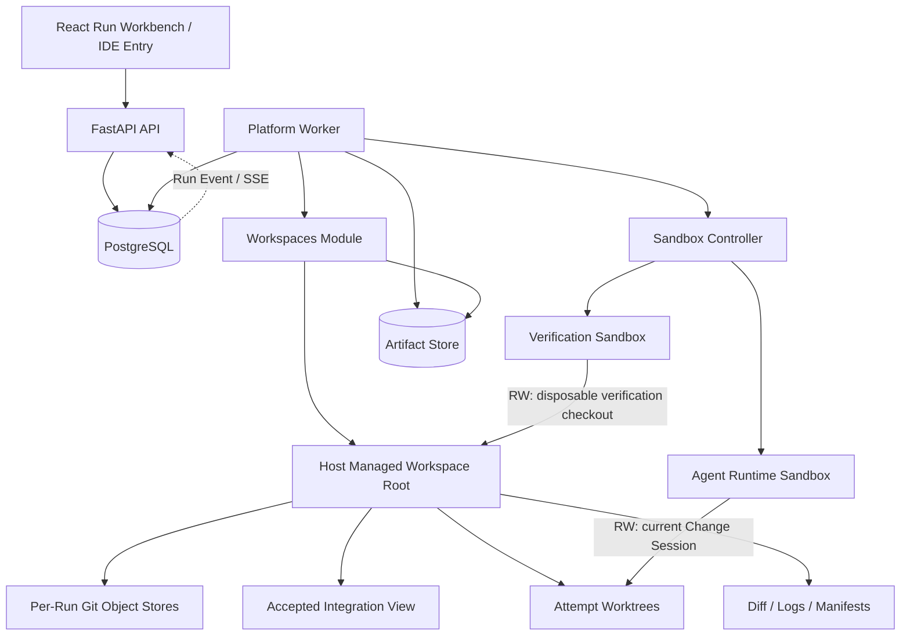
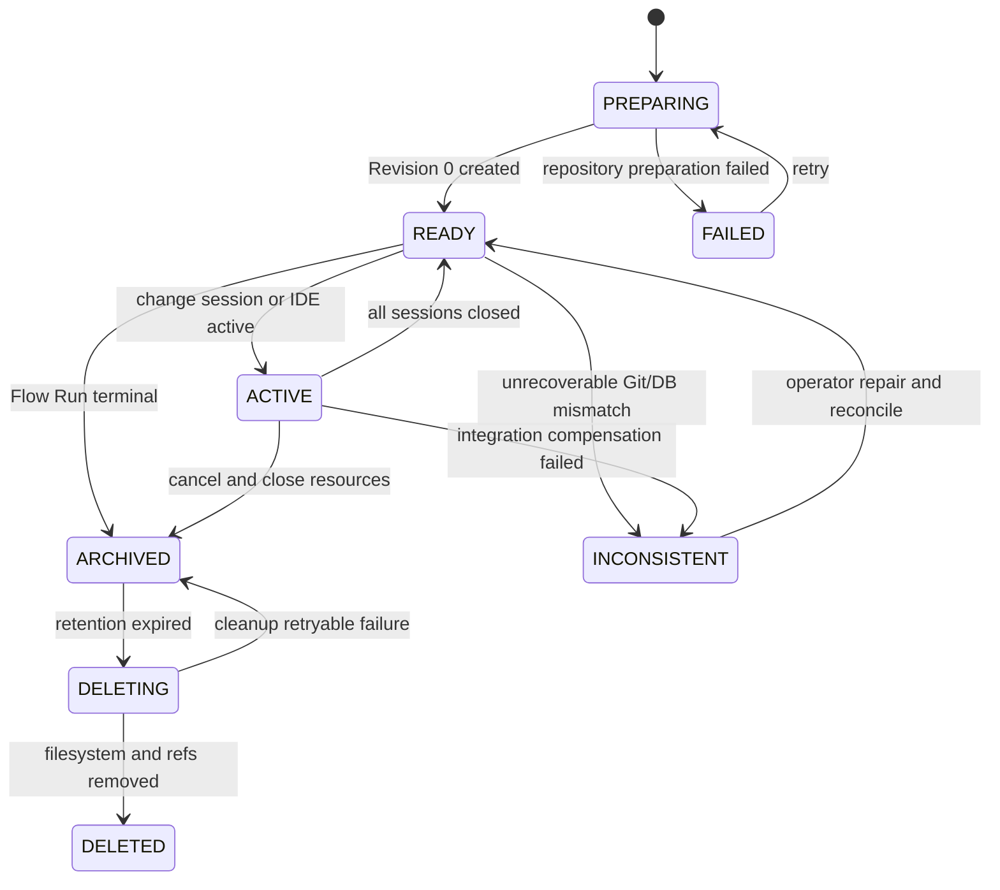
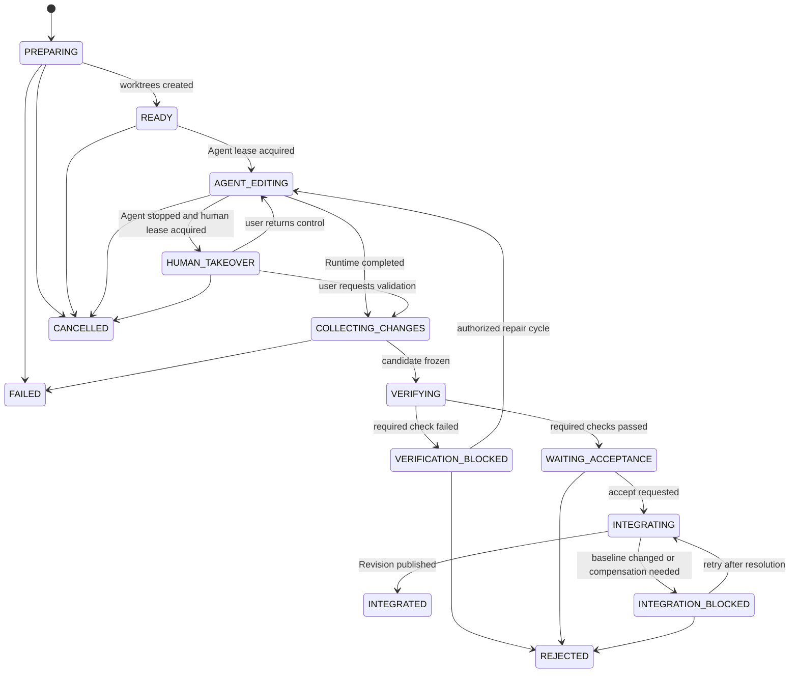
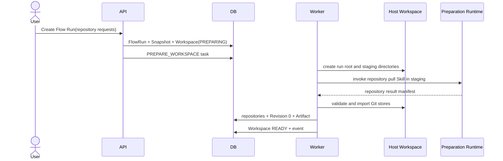
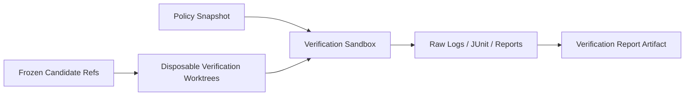

# FlowWeave 工程工作空间与自主研发流程技术设计

> 文档状态：技术方案草案
>
> 对应产品设计：[工程工作空间与自主研发流程产品设计](./engineering-workspace-product-design.md)
>
> 近期交付范围：技术方案输入、多仓库准备、Agent 编码、平台验证、IDE 审查、人工验收、Workspace Revision 发布
>
> 长期演进范围：自动修复、跨节点重做、动态执行图、PR/CI、发布与上线验证

## 1. 方案摘要

本方案在现有 `Flow Run + Run Snapshot + Node Run + Attempt + Artifact Version` 模型之上新增 `workspaces` 领域模块。每个启用工程能力的 Flow Run 最多拥有一个 Engineering Workspace；一个 Workspace 管理多个仓库、一个当前已验收 Workspace Revision，以及各编码 Attempt 的独立 Change Session。

核心技术决策如下：

1. **流程级共享、Attempt 级写隔离**：同一 Flow Run 的节点共享已验收 Workspace Revision；每个编码 Attempt 使用独立 Git worktree，不能直接写流程集成视图。
2. **宿主机持久化、容器按需挂载**：Git 对象库、worktree、候选版本和验证日志位于宿主机受管目录；Runtime 只挂载当前 Attempt 所需目录。
3. **第一阶段直接采用 worktree**：不实现“所有节点共享一个可写目录”的过渡版本，避免之后重做审计、冲突和回退模型。
4. **平台是工程状态权威**：仓库拉取 Skill 可以解析并拉取仓库，但目录分配、仓库校验、commit/tree hash、Diff、Changeset 和 Revision 均由平台重新计算。
5. **代码输出由平台采集**：Coding Agent 完成时只声明“执行完成”和实现摘要；平台冻结工作树、生成候选 commit、Changeset 和 Verification Report，不信任 Agent 自报的文件清单或测试结论。
6. **验收是异步集成事务**：用户接受后先进入 `INTEGRATING`，Worker 以 CAS 和持久化操作日志更新多仓库受管引用，成功后才将 Attempt 标记为 `ACCEPTED` 并发布新的 Workspace Revision。
7. **确定性验证与语义评审分离**：测试、构建、lint、类型检查和路径策略由 Verification Runner 执行；Evaluator Agent 只补充语义判断。
8. **外部副作用晚绑定**：Phase 1 不 Push、不创建 PR、不部署；后续通过 Action Policy 和独立任务接入。
9. **所有慢操作可恢复**：仓库准备、Change Session 创建、冻结、验证、集成和清理均由现有 Background Task lease/fencing 驱动，并以 Workspace Operation 保存外部动作检查点。
10. **历史只追加**：旧 Attempt、候选 commit、Workspace Revision、Changeset、验证报告和 Decision 不被覆盖。

## 2. 目标与非目标

### 2.1 Phase 1 技术目标

- 同一 Flow Run 支持一个宿主机持久化、多仓库 Engineering Workspace；
- 不同 Flow Run 的工作目录、Git refs、未验收代码和 Runtime 挂载严格隔离；
- 仓库名可通过现有 Skill 解析和拉取；
- Coding Agent 基于技术方案和精确 Workspace Revision 修改一个或多个仓库；
- 每个 Attempt 拥有独立 worktree 和候选 Git commit；
- 平台能生成多仓库 Changeset、Diff 和结构化 Verification Report；
- 用户可在 IDE 中审查或接管当前 Change Session；
- 接受后生成新的 Workspace Revision，后续节点只消费该已验收版本；
- 驳回后保留上一 Attempt，并允许新 Attempt 复用上一候选代码作为种子；
- Runtime、Worker 或宿主机进程重启后能恢复工作；
- 清理操作不会删除仍被 Runtime、验证任务或 IDE 会话使用的目录。

### 2.2 Phase 1 非目标

- 并行集成多个写入型 Change Session；
- 自动解决同仓库冲突；
- 自动 Push、创建或合并 PR；
- 自动发布生产；
- 全局 Git 对象缓存；
- 浏览器 IDE；
- 跨仓库真正的 Git 原子提交；
- 让 LLM 替代确定性质量门禁。

### 2.3 长期目标

- 多个 Change Session 并行执行与串行/自动集成；
- Verification 失败后在预算内自动修复；
- Execution Decision 驱动重试、跨节点 Rework 和失效传播；
- PR、CI、制品、部署和上线观察成为正式产物；
- Planner 根据当前产物池动态扩展运行态执行图。

## 3. 与现有架构的关系

### 3.1 保留的领域不变量

本方案不改变以下现有规则：

- Node Asset 是复用定义，Flow Node 是画布实例；
- Attempt 固定引用创建时的 Run Snapshot；
- Artifact Version 不可变；
- Input Binding 显式引用具体 Artifact Version；
- Reject 创建新 Attempt，不覆盖旧 Attempt；
- Runtime 不持有数据库凭据、Docker Socket 或模型密钥解密能力；
- Background Task 使用 lease owner、lease generation 和 fencing；
- Sandbox Controller 是唯一 Docker Socket 持有者；
- 外部 I/O 与数据库状态提交分离，并通过稳定 execution key 保证幂等。

### 3.2 需要调整的现有行为

当前实现中的以下行为需要扩展：

| 当前行为 | Phase 1 调整 |
|---|---|
| Attempt 工作区位于节点资产 `sessions/` 下 | Coding Attempt 改为 Flow Run Workspace 下的 Change Session；普通节点继续兼容旧路径 |
| Runtime 输出只正式接收 URL | Coding 输出由平台从 worktree 采集为 `CODE_CHANGESET_GROUP`、`VERIFICATION_REPORT` 等 Artifact |
| Runtime 完成后直接进入 END Gate | Coding Runtime 完成后先 `COLLECTING_CHANGES → VERIFYING` |
| Accept 同步把 Attempt 置为 ACCEPTED | Coding Attempt 先进入异步 `INTEGRATING`，集成成功后才 ACCEPTED |
| Accept 后直接按端口映射激活下游 | 仅在 Workspace Revision 发布完成后激活下游 |
| Sandbox 只有一个工作区挂载 | 扩展为固定目标、多挂载、读写权限明确的 Runtime Mount Spec |
| Node Asset 只有通用 executor 配置 | 增加 execution profile、workspace access 和 verification policy |

### 3.3 模块边界

新增模块：

```text
services/platform/src/flowweave/modules/workspaces/
├── domain/
│   ├── enums.py
│   ├── rules.py
│   └── manifests.py
├── application/
│   ├── service.py
│   ├── operations.py
│   ├── git_service.py
│   └── verification.py
├── infrastructure/
│   ├── models.py
│   ├── filesystem.py
│   ├── git.py
│   └── verification_runner.py
├── presentation/
│   └── router.py
└── public.py
```

职责划分：

| 模块 | 新增或调整职责 |
|---|---|
| `catalog` | 保存节点执行画像、工作空间访问和验证策略 |
| `flows` | 保存 Flow 是否启用工作空间及 Flow Node override；冻结到 Run Snapshot |
| `runs` | 继续拥有 Flow Run、Attempt、Artifact、Binding、Human Action 和 Run Event |
| `workspaces` | 拥有 Workspace、Repository、Revision、Change Session、Verification、Operation 和 IDE Session |
| `orchestration` | 协调 Attempt 状态、任务投递、人工命令和下游激活，只通过 `workspaces.public` 调用工作空间能力 |
| `tasks` | 注册工作空间相关后台任务处理器 |
| `sandboxes` | 支持受控多挂载和 Verification Sandbox |
| `runtime` | 注入工程上下文，支持 Coding 完成协议 |
| `shared` | 只保留通用 Port、错误和配置，不承载工作空间领域逻辑 |

跨模块引用必须继续经目标模块的 `public.py`，符合现有架构测试。

## 4. 总体架构



### 4.1 控制面与数据面

控制面：

- PostgreSQL 中的 Workspace、Revision、Change Session、Operation 和 Verification 状态；
- Run Snapshot、Attempt 状态、Artifact 元数据和审计事件；
- Sandbox desired/observed ledger；
- 权限、预算、保留期和策略。

数据面：

- 宿主机 Git 对象库和 worktree；
- Artifact Store 中的 Diff、manifest、测试日志和报告；
- Runtime/Verification Sandbox；
- 远程 Git 服务和后续 CI/CD 系统。

数据库是业务状态权威；Git refs 是代码状态权威；`integration/` 目录只是可修复的物化视图，不作为一致性判定依据。

## 5. 宿主机目录与 Git 模型

### 5.1 根目录

新增配置：

```text
FLOWWEAVE_ENGINEERING_WORKSPACE_ROOT=<workspace_root>/flow-runs
FLOWWEAVE_RUNTIME_WORKSPACE_ROOT=/workspaces/flow-runs
```

默认宿主机目录仍位于现有 `workspace_root` 下，便于 Controller 复用统一根目录校验。配置初始化时必须验证：

- 路径为绝对解析后的受管子目录；
- 不能等于文件系统根、用户 HOME 或现有 artifact root；
- Runtime 根为绝对 POSIX 路径；
- 目录不能包含指向根外的符号链接；
- API、Worker、Controller 对该路径的映射一致。

### 5.2 目录布局

```text
<engineering-root>/<flow-run-id>/
├── repositories/
│   └── <repository-id>.git/            # 本 Run 私有 bare Git object store
├── integration/                        # 当前已验收 Revision 的 IDE 物化视图
│   └── <safe-alias>/                    # 受管 worktree，Agent 永不直接写
├── attempts/
│   └── <attempt-id>/
│       ├── repositories/
│       │   └── <safe-alias>/            # 当前 Change Session 的 RW worktree
│       ├── inputs/                      # 当前输入物化，只读挂载
│       ├── output/                      # Agent 仅可写结构化完成声明
│       └── reports/                     # 平台采集结果，Agent 默认不可写
├── verification/
│   └── <verification-run-id>/
│       ├── repositories/                # 候选 commit 的一次性验证 worktree
│       └── output/                      # 原始日志、JUnit、coverage 等
├── staging/
│   └── <workspace-operation-id>/        # 仓库拉取 Skill 的隔离落点
├── control/                             # 仅平台可读写，不挂入 Agent Runtime
│   ├── manifests/
│   ├── locks/
│   └── operation-journal/
└── archives/                            # 可选 Git bundle / cleanup 中间结果
```

数据库只保存相对路径 `root_ref`，不保存可被客户端提交的绝对宿主机路径。所有路径都由 `workspace_id/repository_id/attempt_id` 通过平台函数推导。

### 5.3 Git 引用

每个仓库使用以下平台受管 refs：

```text
refs/flowweave/base/<repository-id>
refs/flowweave/integration/<flow-run-id>
refs/flowweave/candidates/<change-session-id>/<cycle-no>
refs/flowweave/verification/<verification-run-id>
refs/flowweave/archive/<workspace-revision-id>
```

规则：

- `base` 保存仓库首次加入 Run 时的精确 commit；
- `integration` 指向当前已验收 Workspace Revision 中该仓库的 commit；
- `candidate` 指向一次 Change Session 冻结后的候选 commit；
- `verification` 可选地固定验证目标，验证结束后按保留策略清理；
- 平台命令使用 `git update-ref <ref> <new> <expected-old>`，禁止无条件覆盖；
- Agent 可以在 Attempt worktree 内创建普通分支或 commit，但正式候选 ref 只能由平台创建。

### 5.4 候选 commit 生成

冻结 Change Session 时，对每个可写仓库执行：

1. 校验 worktree 属于预期 bare store；
2. 校验当前基线与 Change Session 记录一致；
3. 读取 `git status --porcelain=v2 -z`，收集新增、修改、删除和重命名；
4. 执行路径、文件大小、敏感文件和子模块策略；
5. 使用受控 index 捕获工作树；
6. `git write-tree` 生成 tree；
7. 以声明的 base commit 为唯一 parent，通过 `git commit-tree` 创建平台候选 commit；
8. 使用 CAS 创建 candidate ref；
9. 重新读取 candidate commit、tree hash 和 Diff；
10. 写入冻结 manifest。

候选 commit 采用 squash 语义：保留 Agent 自己的 commit 作为过程信息，但正式集成候选只表达 `base → candidate tree`。这样可避免 Agent 构造异常父链、合并其他分支或把无关历史带入集成。

平台 Git 子进程必须设置：

```text
GIT_TERMINAL_PROMPT=0
GIT_CONFIG_NOSYSTEM=1
GIT_OPTIONAL_LOCKS=0（只读命令）
core.hooksPath=/dev/null
commit.gpgsign=false
protocol.file.allow=never
```

平台不得执行仓库提供的 hook、外部 diff、textconv 或任意 shell。依赖安装、测试和构建只在 Sandbox 中运行。

### 5.5 Integration 物化视图

`integration/<alias>` 方便用户打开 IDE，但不参与 Revision 一致性判断。其行为：

- 由平台依据当前 Revision manifest 创建或刷新；
- 默认对 Agent Runtime 不可见；
- Phase 1 的 IDE 审查模式为只读；
- 若刷新失败，Workspace Revision 仍然有效，只把 `integration_view_state` 标记为 `STALE` 并投递修复任务；
- 创建后续 Change Session 时直接从 bare store 的 integration ref 建 worktree，不复制 `integration/`。

## 6. 数据模型

### 6.1 设计原则

- 数据库保存领域状态和索引，不保存 Git Diff 大文本；
- 大内容进入 Artifact Store；
- manifest 使用规范化 JSON 并保存 SHA-256；
- 所有可并发命令使用 `state_version` CAS；
- 时间线对象不原地覆盖历史结果；
- 外部文件/Git 操作用 Workspace Operation 记录中间检查点。

### 6.2 `engineering_workspaces`

| 字段 | 类型 | 约束/说明 |
|---|---|---|
| `id` | UUID string | PK |
| `flow_run_id` | UUID string | FK，唯一；每个 Run 最多一个 |
| `state` | string | `PREPARING/READY/ACTIVE/ARCHIVED/FAILED/INCONSISTENT/DELETING/DELETED` |
| `state_version` | integer | CAS，初始 1 |
| `root_ref` | text | 相对 engineering root |
| `current_revision_id` | UUID string nullable | 当前正式 Revision |
| `integration_view_state` | string | `MISSING/CURRENT/STALE/ERROR` |
| `retention_policy_json` | JSONB | 归档和清理策略快照 |
| `disk_usage_bytes` | bigint | 最近观测值 |
| `last_activity_at` | timestamptz | 生命周期判断 |
| `error_code/detail` | string/text | 当前可操作错误 |
| `created_at/updated_at` | timestamptz | 审计 |

数据库约束：`root_ref` 唯一；`flow_run_id` 唯一；`state_version > 0`；`disk_usage_bytes >= 0`。

### 6.3 `workspace_repositories`

| 字段 | 类型 | 约束/说明 |
|---|---|---|
| `id` | UUID string | PK |
| `workspace_id` | UUID string | FK |
| `repository_name` | string | 用户/方案中的业务名 |
| `alias` | string | 安全目录名，Workspace 内唯一 |
| `remote_url` | text | 已脱敏规范化地址 |
| `remote_fingerprint` | string | 防止含凭据 URL 泄漏后的稳定标识 |
| `default_branch` | string nullable | 平台实测值 |
| `base_commit` | string | 首次精确基线 |
| `base_tree_hash` | string | 基线 tree |
| `current_commit` | string | 当前已验收 commit |
| `current_tree_hash` | string | 当前已验收 tree |
| `role` | string | `PRIMARY/DEPENDENCY/TEST/INFRASTRUCTURE/OTHER` |
| `source` | string | `RUN_INPUT/AGENT_PROPOSAL/HUMAN` |
| `read_only` | boolean | 是否禁止变更 |
| `state` | string | `PENDING/FETCHING/READY/FAILED/REMOVED` |
| `row_version` | integer | CAS |
| `error_code/detail` | string/text | 准备失败 |
| `created_at/updated_at` | timestamptz | 审计 |

唯一约束：`(workspace_id, alias)`；推荐附加 `(workspace_id, remote_fingerprint)` 唯一约束，避免同一远端重复登记。

### 6.4 `workspace_revisions` 与 `workspace_revision_entries`

`workspace_revisions`：

| 字段 | 说明 |
|---|---|
| `id/workspace_id/revision_no` | Workspace 内递增版本，唯一 |
| `parent_revision_id` | 上一个正式 Revision |
| `manifest_json/manifest_hash` | 完整多仓版本清单及规范化 hash |
| `artifact_version_id` | 对应正式 `WORKSPACE_REVISION` Artifact |
| `created_from_attempt_id` | 哪次 Attempt 集成产生 |
| `created_from_operation_id` | 哪次集成 Operation |
| `created_at` | 创建时间 |

`workspace_revision_entries`：

| 字段 | 说明 |
|---|---|
| `workspace_revision_id/repository_id` | 联合唯一 |
| `commit_hash/tree_hash` | 精确代码版本 |
| `previous_commit_hash` | 上一 Revision 的版本 |
| `changed` | 本次是否改变 |

Revision manifest 必须完整列出 Workspace 内所有未移除仓库，不能只记录发生变化的仓库。

### 6.5 `change_sessions`

| 字段 | 类型 | 说明 |
|---|---|---|
| `id` | UUID string | PK |
| `workspace_id` | UUID string | FK |
| `attempt_id` | UUID string | FK，唯一 |
| `base_revision_id` | UUID string | 固定基线 |
| `seed_change_session_id` | UUID nullable | 驳回重试时可复用上一候选 tree |
| `state` | string | 见状态机 |
| `state_version` | integer | CAS |
| `cycle_no` | integer | 同一 Attempt 内冻结/验证循环 |
| `root_ref` | text | Attempt 相对路径，唯一 |
| `write_owner_type` | string nullable | `AGENT/HUMAN/PLATFORM` |
| `write_owner_id` | string nullable | Runtime、用户或任务标识 |
| `write_lease_until` | timestamptz nullable | 写租约 |
| `candidate_manifest_json/hash` | JSONB/string nullable | 最近冻结候选 |
| `changeset_artifact_id` | UUID nullable | 最新 Changeset Artifact |
| `accepted_revision_id` | UUID nullable | 集成结果 |
| `error_code/detail` | string/text | 可操作错误 |
| `created_at/frozen_at/closed_at` | timestamptz | 审计 |

Phase 1 使用 PostgreSQL partial unique index，保证一个 Workspace 只有一个非终态写入 Session：

```sql
CREATE UNIQUE INDEX uq_workspace_single_writer
ON change_sessions (workspace_id)
WHERE state IN (
  'PREPARING', 'READY', 'AGENT_EDITING', 'HUMAN_TAKEOVER',
  'COLLECTING_CHANGES', 'VERIFYING', 'WAITING_ACCEPTANCE', 'INTEGRATING'
);
```

长期并行时通过前向迁移删除该索引，数据模型无需改变。

### 6.6 `change_session_repositories`

每个 Change Session 对每个仓库保存：

- `change_session_id/repository_id` 联合唯一；
- `access_mode`：`READ_ONLY/READ_WRITE/EXCLUDED`；
- `base_commit/base_tree_hash`；
- `seed_commit`；
- `worktree_ref`；
- `candidate_commit/candidate_tree_hash`；
- `candidate_ref`；
- `changed_file_count/additions/deletions`；
- `state`：`PREPARING/READY/DIRTY/FROZEN/FAILED/CLEANED`；
- `error_code/detail`。

只读仓库也进入 Change Session manifest，但不允许产生与 base 不同的 candidate tree。

### 6.7 `workspace_operations`

Background Task 负责调度和 lease；Workspace Operation 负责记录一次可能跨多个文件/Git ref 的业务操作。

| 字段 | 说明 |
|---|---|
| `id/workspace_id` | 操作身份 |
| `operation_type` | `PREPARE_WORKSPACE/PREPARE_SESSION/FREEZE/VERIFY/INTEGRATE/REFRESH_VIEW/ARCHIVE/CLEANUP` |
| `target_id` | Repository、Session、Verification 或 Workspace id |
| `idempotency_key` | 唯一 |
| `state` | `PENDING/RUNNING/SUCCEEDED/FAILED/COMPENSATING/INCONSISTENT` |
| `lease_generation` | 业务 fencing generation |
| `plan_json` | 冻结后的操作计划 |
| `checkpoint_json` | 已完成的仓库和外部动作 |
| `result_json` | 最终摘要 |
| `error_code/detail` | 失败 |
| `created_at/updated_at/finished_at` | 审计 |

任务重试必须读取 Operation checkpoint，不重复执行已确认成功的步骤。

### 6.8 `verification_runs` 与 `verification_steps`

`verification_runs`：

- `id/change_session_id/cycle_no`；
- `candidate_manifest_hash`；
- `policy_snapshot_json/policy_hash`；
- `environment_version_id`；
- `state`：`PENDING/RUNNING/PASSED/FAILED/ERROR/CANCELLED`；
- `required_passed`；
- `failure_class`：`CODE/ENVIRONMENT/INFRASTRUCTURE/POLICY`；
- `failure_fingerprint`；
- `report_artifact_id`；
- `started_at/finished_at`。

`verification_steps`：

- `verification_run_id/position/name` 唯一；
- `repository_id` nullable，空表示跨仓步骤；
- `command_json`，以 argv 形式保存，禁止隐式 shell；
- `working_directory`；
- `required`；
- `timeout_seconds`；
- `state/exit_code/duration_ms`；
- `stdout_artifact_id/stderr_artifact_id/result_artifact_id`；
- `failure_fingerprint/error_code`。

### 6.9 `workspace_access_sessions`

用于 IDE 审查/接管：

- `workspace_id/change_session_id`；
- `subject_id`；
- `mode`：`REVIEW_READ_ONLY/TAKEOVER_READ_WRITE`；
- `transport`：`LOCAL_PATH/SSH_REMOTE/GATEWAY`；
- `state`：`ACTIVE/REVOKED/EXPIRED/CLOSED`；
- `token_digest`，仅托管隧道模式使用；
- `connection_metadata_json`，不得包含长期密钥；
- `expires_at/last_activity_at/created_at/closed_at`。

### 6.10 长期数据模型

Phase 2/3 再增加：

- `execution_decisions`：Agent/Human/Policy 的建议、裁决和执行状态；
- `artifact_relations`：`DERIVED_FROM/SUPERSEDES/INVALIDATES/VERIFIED_BY/REJECTED_BY`；
- `node_run_rework_relations`：新 Node Run 与被重做 Node Run 的关系；
- `external_actions`：Push、PR、Merge、Deploy、Rollback 的幂等执行记录；
- `workspace_integration_queue`：并行 Change Session 的有序集成。

## 7. 配置与快照

### 7.1 Node Executor 配置

扩展 `NodeExecutorConfig`：

```json
{
  "execution_profile": "CODING_AGENT",
  "workspace_access": "READ_WRITE",
  "repository_scope": {
    "roles": ["PRIMARY", "DEPENDENCY"],
    "aliases": [],
    "allow_paths": ["**"],
    "deny_paths": [".flowweave/**"]
  },
  "verification_policy": {
    "steps": [],
    "max_cycles": 1,
    "required_failure_action": "BLOCK_ACCEPTANCE"
  }
}
```

枚举：

- `execution_profile`: `GENERAL_AGENT/WORKSPACE_AGENT/CODING_AGENT/EVALUATOR_AGENT/RELEASE_AGENT`；
- `workspace_access`: `NONE/READ_ONLY/READ_WRITE`。

一致性规则：

- `CODING_AGENT` 必须 `READ_WRITE`；
- `EVALUATOR_AGENT` 默认 `READ_ONLY`；
- `GENERAL_AGENT` 默认 `NONE`；
- `READ_WRITE` 节点必须声明 `CODE_CHANGESET_GROUP` 和 `VERIFICATION_REPORT` 输出，或者使用系统隐式输出；
- Phase 1 一个 Flow 中可以有多个 Coding Node，但同一 Run 运行时只允许一个写 Session。

### 7.2 Flow 配置

Flow Definition 增加：

```json
{
  "engineering_workspace": {
    "enabled": true,
    "repository_input_key": "repository_requests",
    "preparation_node_key": "prepare_workspace",
    "single_writer": true,
    "retention_policy": "STANDARD",
    "autonomy_level": "L1"
  }
}
```

这些配置必须进入 Run Snapshot。Attempt 始终使用其 Snapshot 中的 executor、repository scope 和 verification policy；编辑态修改不能影响已创建 Attempt。

### 7.3 验证策略合并

策略来源由低到高：

1. Agent 建议；
2. 仓库可信配置；
3. Node Asset；
4. Flow/Run 显式策略；
5. 组织强制策略。

合并规则不是普通 JSON merge：

- 高优先级可以增加 required step；
- 低优先级不能删除或放宽高优先级 required step；
- timeout 取允许范围内的更严格值；
- deny path 取并集，allow path 取交集；
- 网络权限取最小权限；
- 最终生成不可变 `policy_snapshot_json` 和 hash。

Phase 1 可先实现 Node Asset + Run override 两层，保留 schema_version 为后续扩展。

## 8. 状态机

### 8.1 Engineering Workspace



### 8.2 Change Session



终态：`INTEGRATED/REJECTED/CANCELLED/FAILED`。`FAILED` 只表示平台无法完成 Session 准备或冻结，不等于代码验证失败。

### 8.3 Coding Attempt 状态

扩展 `AttemptState`：

- `PREPARING_WORKSPACE`；
- `COLLECTING_CHANGES`；
- `VERIFYING`；
- `VERIFICATION_BLOCKED`；
- `INTEGRATING`；
- `INTEGRATION_BLOCKED`。

主路径：

```text
WAITING_INPUT
→ START_GATES
→ WAITING_START_CONFIRMATION
→ PREPARING_WORKSPACE
→ EXECUTING
→ COLLECTING_CHANGES
→ VERIFYING
→ END_GATES
→ WAITING_ACCEPTANCE
→ INTEGRATING
→ ACCEPTED
```

普通节点保持现有状态路径。状态迁移由 execution profile 分派，不能让 Coding 状态影响 General Agent。

### 8.4 Accept 语义

General Agent 的 Accept 保持同步。Coding Agent：

1. API 以 `expected_state_version` CAS 将 Attempt 从 `WAITING_ACCEPTANCE` 改为 `INTEGRATING`；
2. 写入 `ACCEPT_ATTEMPT_REQUESTED` Human Action；
3. 创建 `INTEGRATE_CHANGE_SESSION` Operation 和 Background Task；
4. Worker 执行 Git refs 集成；
5. 成功后在同一数据库事务创建 Workspace Revision、正式 Artifact、更新 Attempt/Node Run，并激活映射下游；
6. API 返回 202 或最新运行详情；前端通过 SSE 等待 `WORKSPACE_REVISION_PUBLISHED`。

在步骤 5 前，当前代码不能被下游节点当作正式输入。

## 9. 关键业务流程

### 9.1 创建 Flow Run 和 Workspace



创建 Workspace 可采用 eager 或 lazy 模式：

- Run 带 `REPOSITORY_REQUESTS` 时 eager；
- 第一个需要 Workspace 的节点启动时 lazy；
- 幂等键为 `prepare-workspace:<workspace-id>:<request-hash>`；
- 同一 Workspace 同时只允许一个 PREPARE operation。

### 9.2 仓库拉取 Skill 协议

平台为 Skill 分配 staging 目录，不允许 Skill 决定宿主机目标路径。运行输入：

```json
{
  "schema_version": 1,
  "workspace_id": "...",
  "repositories": [
    {
      "repository_name": "order-service",
      "destination": "/workspace/staging/order-service",
      "requested_ref": "main",
      "role": "PRIMARY"
    }
  ]
}
```

Skill 输出到固定结果文件：

```json
{
  "schema_version": 1,
  "repositories": [
    {
      "repository_name": "order-service",
      "destination_alias": "order-service",
      "resolved_remote_url": "ssh://git.example/order-service.git",
      "resolved_ref": "main",
      "resolved_commit": "..."
    }
  ]
}
```

平台随后独立校验：

- destination 位于本 Operation staging 根；
- 没有符号链接目录逃逸；
- 是有效 Git worktree；
- `HEAD`、remote 和 commit 可读取；
- remote URL 不含 userinfo、token 或明文密码；
- commit 满足 requested ref 策略；
- 仓库体积、文件数和对象数在限额内；
- 没有重复 remote fingerprint。

验证通过后，平台从 staging 建立本 Run 私有 bare store、创建受管 refs 和 integration worktree，再删除 staging。Skill 声明不直接写入数据库。

### 9.3 创建 Coding Attempt

1. Readiness 校验技术方案、仓库请求和 Workspace READY；
2. 平台将当前 Workspace Revision 作为系统上下文固定到 Attempt；
3. START Gate 和人工确认按现有逻辑运行；
4. 确认后 Attempt 进入 `PREPARING_WORKSPACE`；
5. `PREPARE_CHANGE_SESSION` 为每个可见仓库创建 worktree；
6. 对读写仓库创建 Attempt 专用 branch/ref，对只读仓库创建 detached worktree；
7. 写入 `change_session_repositories`；
8. Session READY 后投递现有 `START_RUNTIME`；
9. Runtime 工作目录为 `/workspace/repositories`。

如果新 Attempt 来自 Reject：

- 默认 `base_revision_id` 仍是当前正式 Revision；
- 可设置 `seed_change_session_id`；
- 新 worktree 初始 tree 使用上一候选 tree，但正式 candidate 的 parent 仍为当前 base commit；
- Previous Feedback、上一 Changeset 和 Verification Report 自动加入输入；
- 该 seed 不会变成正式 Workspace Revision，也不会被其他节点看见。

### 9.4 Runtime 工程上下文

Coding Runtime 初始消息包括：

- 技术方案 Artifact 及版本；
- 当前任务范围和验收标准；
- Workspace Revision id/hash；
- 仓库 alias、角色、base commit 和访问模式；
- 容器内固定路径；
- allow/deny path；
- 验证步骤摘要；
- 上一轮反馈；
- 明确说明不得修改平台 control 目录、不得 Push、不得声称自报测试等于平台验证。

Agent 完成协议：

```json
{
  "flowweave": {
    "action": "coding_complete",
    "summary": "...",
    "design_traceability": [
      {"design_item": "TD-3", "repositories": ["order-service"], "files": ["src/..."]}
    ],
    "open_issues": [],
    "tests_run_by_agent": ["pnpm test"]
  }
}
```

这些字段是说明性输入。平台不接受 Agent 提供的 commit hash、文件清单或“测试通过”作为正式证据。

### 9.5 冻结和采集 Changeset

Runtime 完成后：

1. 停止 Runtime 写入并撤销 Agent write lease；
2. Attempt/Session 进入 `COLLECTING_CHANGES`；
3. 创建 FREEZE Operation，固定仓库列表、base commits 和 cycle_no；
4. 按仓库生成候选 commit/ref；
5. 生成 per-repository Diff、统计和 manifest；
6. 生成 `CODE_CHANGESET_GROUP` Artifact；
7. 计算 candidate manifest hash；
8. 若无任何变更且节点要求代码输出，则以 `NO_CODE_CHANGES` 阻塞；
9. 成功后创建 Verification Run。

Changeset Artifact 示例：

```json
{
  "schema_version": 1,
  "workspace_id": "...",
  "base_revision_id": "...",
  "candidate_manifest_hash": "sha256:...",
  "repositories": [
    {
      "alias": "order-service",
      "base_commit": "...",
      "candidate_commit": "...",
      "base_tree": "...",
      "candidate_tree": "...",
      "diff_artifact_id": "...",
      "files_changed": 8,
      "additions": 214,
      "deletions": 37
    }
  ]
}
```

### 9.6 Verification Runner

验证不在 Agent 正在编辑的 worktree 上执行。Worker 为 candidate commits 创建一次性 verification worktree：



理由：测试和构建会写缓存、编译产物或生成文件，不能污染冻结候选代码。

每个 step 使用 argv + cwd 表达：

```json
{
  "name": "platform-unit-tests",
  "repository_alias": "flowweave",
  "argv": ["uv", "run", "pytest", "services/platform/tests"],
  "working_directory": ".",
  "timeout_seconds": 900,
  "required": true,
  "network_mode": "isolated"
}
```

禁止默认使用 `sh -c`；若确需 shell，策略必须显式 `shell: true`，并把整条命令视为不可信代码在 Sandbox 中执行。

验证结果必须绑定：

- candidate manifest hash；
- 每仓 candidate commit/tree；
- environment version digest；
- policy hash；
- step argv 和 cwd；
- 开始/结束时间、退出码和原始日志 hash。

只要 candidate manifest 变化，旧 Verification Report 自动失效，不能用于验收。

### 9.7 人工接管

接管命令：

1. CAS 校验 Attempt/Session 可接管；
2. 若 Runtime 正在生成，先持久化 STOP/CANCEL 意图并等待 Runtime 确认停止；
3. 撤销 Agent write lease；
4. 创建 `workspace_access_session`；
5. 将 Session 置为 `HUMAN_TAKEOVER`；
6. 返回本地路径或远程 IDE descriptor；
7. 记录 `WORKSPACE_HUMAN_TAKEOVER_STARTED`。

交回命令：

- 关闭/撤销 IDE write session；
- 采集当前 tree hash；
- 用户选择“交回 Agent”或“直接验证”；
- 任一选择都使之前 Verification 失效；
- 记录接管前后 hash 和用户说明。

不能仅通过 UI 状态假设 Agent 已停止。Controller 必须确认对应 Runtime 不再运行，平台才授予人工写租约。

### 9.8 多仓库集成

Git 不提供跨仓库事务，因此使用可补偿 Saga。

**Prepare 阶段**：

1. 锁定 Workspace 行；
2. CAS 校验 `workspace.current_revision_id == session.base_revision_id`；
3. 校验 Verification Report 与 candidate manifest hash 一致且 required checks 通过；
4. 为每个仓库生成 `{ref, expected_old, desired_new}`；
5. 创建持久化 Integration Operation plan；
6. Attempt/Session 进入 `INTEGRATING`。

**Apply 阶段**：

按 repository id 稳定排序执行：

```text
git update-ref <integration-ref> <candidate> <expected-old>
```

每成功一个仓库立即写 Operation checkpoint。任务丢租约后停止继续写，新的 Worker 从 checkpoint 恢复并重新验证 ref。

**Commit 阶段**：

所有 refs 到达 desired commit 后，在一个数据库事务中：

- 创建新 Workspace Revision 和 entries；
- 创建 `WORKSPACE_REVISION` Artifact；
- 更新 Workspace current revision；
- 更新 repository current commit/tree；
- Session `INTEGRATED`；
- Attempt `ACCEPTED`；
- Node Run `ACCEPTED`；
- 写 Human Action/Run Event；
- 激活端口映射目标；
- Operation `SUCCEEDED`。

**补偿阶段**：

若某仓库 CAS 失败：

- 对已更新仓库执行反向 `update-ref old expected-new`；
- 全部恢复后 Session 进入 `INTEGRATION_BLOCKED`；
- 任一反向 CAS 失败则 Workspace 进入 `INCONSISTENT`，禁止新 Coding Attempt；
- 由 reconcile 命令根据 Operation plan 和实际 refs 给出修复方案，不能猜测覆盖。

Integration 视图刷新在正式 Revision 发布后异步进行，失败不回滚 Revision。

## 10. Sandbox 与挂载协议

### 10.1 当前限制

当前 Managed Sandbox 规格只有一个 `workspace_relative`，Docker Provider 将其挂载到 Runtime workspace root。工程模式需要区分可写代码、只读输入、节点能力和平台不可见控制目录。

### 10.2 Runtime Mount Spec v2

扩展 Sandbox spec：

```json
{
  "schema_version": 2,
  "mounts": [
    {
      "kind": "ATTEMPT_REPOSITORIES",
      "source_relative": "flow-runs/<run>/attempts/<attempt>/repositories",
      "target": "/workspace/repositories",
      "mode": "rw"
    },
    {
      "kind": "ATTEMPT_INPUTS",
      "source_relative": "flow-runs/<run>/attempts/<attempt>/inputs",
      "target": "/workspace/inputs",
      "mode": "ro"
    },
    {
      "kind": "NODE_RESOURCES",
      "source_relative": "nodes/<asset>/runtime-resources/<snapshot-hash>",
      "target": "/node-resources",
      "mode": "ro"
    },
    {
      "kind": "COMPLETION_OUTPUT",
      "source_relative": "flow-runs/<run>/attempts/<attempt>/output",
      "target": "/workspace/output",
      "mode": "rw"
    }
  ]
}
```

Controller 校验：

- `kind` 必须在固定 allowlist；
- target 必须是该 kind 对应的固定容器路径，Worker 不能自定义；
- source 必须是受管根下的规范相对路径；
- 解析路径不得包含 `.`、`..` 或符号链接；
- source 必须属于 owner Attempt/Workspace/Node Snapshot；
- ro/rw 必须符合 kind 固定权限；
- mount spec 纳入不可变 sandbox signature，不能在同一活跃 Sandbox 上提升权限；
- Runtime 不能挂载 `control/`、其他 Attempt 或其他 Flow Run。

### 10.3 Verification Sandbox

新增 Sandbox kind `VERIFICATION_RUNTIME`，owner 为 Verification Run：

- 挂载一次性 verification worktrees 为 RW；
- 挂载 output 为 RW；
- 不挂载 Agent 会话目录；
- 默认无模型凭据；
- 默认 isolated network；只有策略显式允许的依赖下载步骤使用 egress；
- 使用环境版本 digest、CPU/内存/PID/时间限制；
- 运行结束后请求删除 Sandbox，宿主机日志和结果继续保留。

### 10.4 权限与 UID/GID

- Runtime 继续使用非 root 固定 UID/GID；
- Workspace Manager 创建目录时设置为该受管 UID/GID 可读写；
- control 和 bare stores 不挂入 Runtime；
- Attempt worktree 的 `.git` 文件通常指向宿主机 bare store，若 bare store 不挂载，容器内 Git 命令不可用；因此需采用以下二选一：
  - 推荐：把每个 Attempt 的 Git metadata 以受限 RW 辅助挂载到固定 `/workspace/.git-stores/<repo-id>`，worktree `.git` 指向容器路径；
  - 备选：在 Attempt 目录内使用独立 clone，验收时再向受管 bare store导入。

Phase 1 采用推荐方案，但 Controller 必须只挂当前 Session 对应的 Git common dir，不能挂整个 Workspace `repositories/`。Agent 可修改自身分支 refs，但正式 `refs/flowweave/*` 通过文件权限或 namespace 规则由平台保护。若无法可靠限制 ref 写入，则 Agent worktree 使用独立 clone，平台在冻结时导入 candidate tree；安全优先于对象复用。

实施前需用目标 OpenHands 镜像验证 Git worktree `.git` 指针在双路径映射下的行为。验证失败时选独立 clone 方案，不以软链接绕过挂载边界。

## 11. Runtime 协议调整

### 11.1 `StartAttemptRequest`

新增：

```python
execution_profile: str
workspace_context: WorkspaceRuntimeContext | None
runtime_mounts: tuple[RuntimeMount, ...]
completion_contract: str  # URL_OUTPUTS | CODING_COMPLETION
verification_summary: dict[str, object]
```

逐步废弃由 `workspace_ref/node_workspace_ref` 推导所有路径的单根模式，但保留对普通节点的兼容适配。

### 11.2 `RuntimeResult`

新增结构化 completion：

```python
@dataclass(frozen=True)
class RuntimeCompletion:
    kind: Literal["GENERAL_OUTPUTS", "CODING_COMPLETE"]
    summary: str
    payload: dict[str, object]
```

Coding Result 不直接携带 Changeset Artifact。Runtime 只返回 `CODING_COMPLETE`，Worker 随后调度 FREEZE。

### 11.3 事件

新增规范化 Runtime/Run Events：

- `WORKSPACE_PREPARATION_STARTED/COMPLETED/FAILED`；
- `CHANGE_SESSION_PREPARED`；
- `WORKSPACE_WRITE_OWNER_CHANGED`；
- `CODING_RUNTIME_COMPLETED`；
- `CHANGESET_COLLECTION_STARTED/COMPLETED/FAILED`；
- `VERIFICATION_STARTED/STEP_COMPLETED/PASSED/FAILED/ERROR`；
- `HUMAN_TAKEOVER_STARTED/ENDED`；
- `INTEGRATION_STARTED/BLOCKED/COMPLETED`；
- `WORKSPACE_REVISION_PUBLISHED`；
- `INTEGRATION_VIEW_STALE/REFRESHED`；
- `WORKSPACE_INCONSISTENT`。

事件 payload 只放 id、状态、摘要和 hash，不内嵌完整 Diff、日志或凭据。

## 12. 后台任务与幂等

### 12.1 新任务类型

| Task | aggregate | 作用 |
|---|---|---|
| `PREPARE_ENGINEERING_WORKSPACE` | WORKSPACE | 创建根目录并拉取/登记仓库 |
| `PREPARE_CHANGE_SESSION` | CHANGE_SESSION | 创建 Attempt worktrees |
| `FREEZE_CHANGE_SESSION` | CHANGE_SESSION | 候选 commit、Diff、Changeset |
| `RUN_VERIFICATION` | VERIFICATION_RUN | 创建验证 Sandbox 并执行 steps |
| `INTEGRATE_CHANGE_SESSION` | CHANGE_SESSION | 多仓库 Saga 和 Revision 发布 |
| `REFRESH_INTEGRATION_VIEW` | WORKSPACE | 更新 IDE 物化视图 |
| `ARCHIVE_ENGINEERING_WORKSPACE` | WORKSPACE | 生成 bundle/manifest |
| `CLEANUP_CHANGE_SESSION` | CHANGE_SESSION | 删除过期 worktree |
| `CLEANUP_ENGINEERING_WORKSPACE` | WORKSPACE | 保留期后安全删除 |
| `RECONCILE_WORKSPACE` | WORKSPACE | 修复中断操作和实际状态漂移 |

### 12.2 幂等键

```text
prepare-workspace:<workspace-id>:<request-hash>
prepare-session:<change-session-id>:<base-revision-id>
freeze-session:<change-session-id>:<cycle-no>
verify:<change-session-id>:<cycle-no>:<policy-hash>:<candidate-hash>
integrate:<change-session-id>:<candidate-hash>
refresh-integration:<workspace-id>:<revision-id>
cleanup-session:<change-session-id>
cleanup-workspace:<workspace-id>:<retention-generation>
```

### 12.3 外部 I/O 规则

所有 Handler 遵循：

1. 短事务读取并冻结 Operation plan；
2. 结束数据库读事务；
3. 执行 Git/文件/Sandbox 外部 I/O；
4. 检查 Background Task lease generation；
5. 使用 Operation state/version 和目标聚合 state/version CAS 写结果；
6. 业务结果和 task SUCCEEDED 在同一事务提交。

租约丢失后不得继续下一外部步骤。已经发生的外部动作由 Operation checkpoint 和 reconcile 接管。

### 12.4 Reconciler

Worker 启动及周期任务检查：

- PREPARING Workspace 是否有对应 Operation/Task；
- 非终态 Change Session 的目录和 worktree 是否存在；
- candidate refs 与 manifest 是否一致；
- INTEGRATING Operation 的 refs 是否处于 old、new 或混合状态；
- Workspace current Revision 与 repository current refs 是否一致；
- integration view 是否过期；
- terminal Session 是否仍持有 lease；
- 无数据库所有者的目录、worktree、refs 和验证 Sandbox。

Reconciler 只做确定性修复：能根据 operation plan 证明 desired state 时继续；不能证明时标记 `INCONSISTENT` 并停止自动修改。

## 13. API 设计

所有命令使用 `Idempotency-Key` 和 `expected_state_version`。建议路由：

### 13.1 Workspace

```text
GET  /api/v1/flow-runs/{run_id}/workspace
POST /api/v1/flow-runs/{run_id}/workspace
POST /api/v1/workspaces/{workspace_id}/repositories
POST /api/v1/workspaces/{workspace_id}/retry-preparation
GET  /api/v1/workspaces/{workspace_id}/revisions
GET  /api/v1/workspace-revisions/{revision_id}
POST /api/v1/workspaces/{workspace_id}/reconcile
POST /api/v1/workspaces/{workspace_id}/archive
```

创建仓库请求示例：

```json
{
  "expected_state_version": 3,
  "repositories": [
    {
      "repository_name": "order-service",
      "requested_ref": "main",
      "role": "PRIMARY",
      "read_only": false
    }
  ]
}
```

### 13.2 Change Session 与验证

```text
GET  /api/v1/node-attempts/{attempt_id}/change-session
GET  /api/v1/change-sessions/{id}/changeset
GET  /api/v1/change-sessions/{id}/diff?repository_id=&path=
GET  /api/v1/change-sessions/{id}/verification-runs
POST /api/v1/change-sessions/{id}/rerun-verification
POST /api/v1/change-sessions/{id}/resume-agent-repair       # Phase 2
POST /api/v1/change-sessions/{id}/takeover
POST /api/v1/change-sessions/{id}/return-control
POST /api/v1/change-sessions/{id}/retry-integration
```

Diff API 从 Artifact Store 分页/流式读取，不在数据库查询中动态运行无限制 Git Diff。支持：

- 仓库和路径过滤；
- 文件元数据列表；
- 单文件 patch；
- binary/oversized 标记；
- 最大响应大小和 continuation token。

### 13.3 IDE

```text
POST   /api/v1/change-sessions/{id}/ide-sessions
GET    /api/v1/ide-sessions/{id}
DELETE /api/v1/ide-sessions/{id}
```

返回 descriptor，而非长期凭据：

```json
{
  "id": "...",
  "mode": "REVIEW_READ_ONLY",
  "transport": "SSH_REMOTE",
  "remote_uri": "ssh-remote+flowweave-host",
  "path": "/managed/flow-runs/.../attempts/.../repositories",
  "expires_at": "..."
}
```

本地部署才返回绝对 host path。远程部署由配置的 SSH/Gateway adapter 生成 descriptor；平台 API 不回传 SSH 私钥。

### 13.4 Accept/Reject 兼容

保留现有：

```text
POST /api/v1/node-attempts/{attempt_id}/accept
POST /api/v1/node-attempts/{attempt_id}/reject
```

Accept 根据 execution profile 分派；Coding Accept 返回 202 并包含 `integration_operation_id`。Reject 新增：

```json
{
  "expected_state_version": 12,
  "reason": "缺少事务回滚处理",
  "copy_input_bindings": true,
  "seed_from_rejected_candidate": true
}
```

### 13.5 错误码

至少定义：

- `WORKSPACE_NOT_READY`；
- `WORKSPACE_SINGLE_WRITER_CONFLICT`；
- `WORKSPACE_PATH_INVALID`；
- `REPOSITORY_RESOLUTION_FAILED`；
- `REPOSITORY_VALIDATION_FAILED`；
- `REPOSITORY_CREDENTIAL_LEAK_DETECTED`；
- `CHANGE_SESSION_BASE_STALE`；
- `CHANGE_SESSION_WRITE_LEASE_CONFLICT`；
- `CHANGESET_COLLECTION_FAILED`；
- `CHANGESET_POLICY_VIOLATION`；
- `VERIFICATION_REQUIRED_FAILED`；
- `VERIFICATION_RESULT_STALE`；
- `INTEGRATION_CAS_CONFLICT`；
- `INTEGRATION_COMPENSATION_FAILED`；
- `WORKSPACE_INCONSISTENT`；
- `IDE_SESSION_CONFLICT`；
- `WORKSPACE_CLEANUP_BLOCKED`。

## 14. Artifact 契约

### 14.1 新 Artifact Type

- `REPOSITORY_REQUESTS`；
- `WORKSPACE_REVISION`；
- `CODE_CHANGESET_GROUP`；
- `CODE_DIFF`；
- `VERIFICATION_REPORT`；
- `VERIFICATION_LOG`；
- `IMPLEMENTATION_SUMMARY`；
- `OPEN_ISSUES`；
- 长期：`CODE_REVIEW_REPORT/CHANGE_REQUEST/CI_REPORT/RELEASE_RECORD/DEPLOYMENT_EVIDENCE`。

### 14.2 内容存储

| Artifact | 存储 |
|---|---|
| Revision manifest | 小内容可 inline，同时在 control 目录保留副本 |
| Changeset manifest | Artifact Store JSON |
| 小 Diff | Artifact Store text |
| 大 Diff | 压缩对象 + 索引 |
| Verification Report | Artifact Store JSON |
| stdout/stderr | 分段压缩对象 |
| JUnit/coverage | 原始对象 + 解析摘要 |

Artifact metadata 至少包含 schema version、workspace id、attempt id、candidate/revision hash 和 producer operation id。

### 14.3 一致性

- Artifact Store 使用现有 prepare/finalize 模式；
- 先写临时对象并计算 hash，再在数据库事务登记 ArtifactVersion；
- 数据库提交失败时投递临时对象回收；
- Artifact 已登记但 Workspace 操作失败时不删除，作为失败证据保留；
- 正式 Workspace Revision Artifact 只能由成功 Integration Operation 创建。

## 15. IDE 与人工协作实现

### 15.1 部署模式

**Local Path Adapter**：

- 用于平台和用户在同一台开发机；
- 返回宿主机绝对路径；
- 可生成 `vscode://file/...` 仅作为前端可选动作，API 主数据仍为 path；
- 权限依赖本机用户，不用于共享生产部署。

**SSH Remote Adapter**：

- 返回预配置 SSH host alias 和受管 path；
- 用户身份由现有 SSH/SSO 基础设施负责；
- FlowWeave 只签发短期 workspace authorization 或记录授权映射；
- 不创建共享 Unix 账号，不把私钥写入数据库。

**Gateway Adapter（长期）**：

- 平台签发短期 token；
- Gateway 将用户身份映射到只读/读写目录；
- 支持主动撤销、连接心跳和审计。

### 15.2 写入控制

文件系统权限必须配合领域租约：

- 审查模式使用只读挂载或只读 ACL；
- 接管模式只在 Agent Runtime 已停止后授予写 ACL；
- 接管结束立即撤销写 ACL；
- 若部署环境不能可靠实施 ACL，则 Phase 1 只允许本地单用户接管，并明确标识安全边界；
- 平台持续检测 tree hash，任何非预期修改都会使 Verification 失效。

### 15.3 用户直接 commit

允许用户在 Attempt worktree 内 commit，但平台冻结时仍以 worktree 最终 tree 为准生成受管 squash candidate。用户 commit 不会自动 Push，也不直接更新 integration ref。

## 16. 安全设计

### 16.1 路径隔离

- 所有 host path 由服务端根据 opaque id 推导；
- alias 仅允许 `[A-Za-z0-9._-]`，碰撞时附加稳定短 id；
- 每级路径解析时拒绝符号链接；
- 删除前再次解析并确认目标是 `<engineering-root>/<flow-run-id>` 的严格后代；
- 禁止对 workspace root、engineering root、HOME、`/` 使用递归删除；
- Controller 同时校验 owner id、manager scope、mount kind 和相对路径。

### 16.2 Git 凭据

- 凭据由环境/Skill 的受管配置提供；
- remote URL 持久化前移除 userinfo 和敏感 query；
- `.git/config`、日志、Artifact 和 Runtime 消息执行 secret scan；
- 禁止把 SSH private key、credential helper store、token 写入 Flow Run Workspace；
- 外部 Git 动作使用专门身份并记录 actor；
- Phase 1 不由平台 Push。

### 16.3 不可信仓库代码

- 平台宿主机只执行固定 Git argv，不执行仓库脚本；
- 测试、构建、包管理器和生成器只在 Sandbox 中执行；
- 默认关闭网络；
- egress 模式不等于安全代理，生产仍需出口防火墙/代理；
- 限制 CPU、内存、PID、磁盘和超时；
- Verification 不获得模型密钥、数据库凭据或 Docker Socket；
- 对子模块、Git LFS、超大对象和嵌套仓库采用显式策略，默认不自动初始化。

### 16.4 平台元数据

- `control/` 不挂入 Runtime；
- Agent completion 只能写固定 output 目录；
- 数据库中的 manifest 由平台计算，不读取 Agent 伪造的控制文件；
- Runtime 事件中的路径必须归一化为容器内路径，前端不可据此访问宿主机任意文件。

### 16.5 外部副作用

Phase 1 Runtime 网络和 Git 权限只用于读取仓库。Push、PR、CI trigger 和 Deploy 没有对应 API。长期所有副作用通过 `ExternalAction`：

- 显式 action type 和 target；
- policy decision；
- human approval（如需要）；
- stable idempotency key；
- request/response 摘要和外部 id；
- 重试和补偿策略。

## 17. 并发与一致性

### 17.1 锁层次

按以下顺序获取，避免死锁：

1. Workspace PostgreSQL advisory lock（外部 Git 操作分配）；
2. `engineering_workspaces` row lock；
3. Change Session row lock；
4. Repository rows 按 id 排序；
5. Git ref CAS；
6. integration view 文件锁。

数据库事务中不得长期持有 advisory lock等待 Runtime 或测试。advisory lock 只用于短暂分配/集成计划阶段；慢操作依赖 Operation fencing。

### 17.2 基线漂移

Phase 1 single-writer 下仍可能因运维修复或异常产生漂移。集成前比较：

- Workspace current revision；
- 每个 repository current commit；
- 实际 integration ref；
- Session base manifest；
- candidate parent。

任一不一致都停止集成，不自动 rebase。长期可创建 REBASE/CONFLICT_RESOLUTION Change Session。

### 17.3 多仓库业务原子性

正式 Revision 只在所有 repository refs 到达目标后发布。若部分 ref 已更新但 DB 尚未发布，Operation checkpoint 使 Reconciler 能继续或补偿。下游只读数据库 current revision，因此不会看到半完成 Revision。

## 18. 故障恢复

### 18.1 故障矩阵

| 故障点 | 持久状态 | 恢复 |
|---|---|---|
| 拉取中 Worker 崩溃 | Workspace Operation RUNNING + staging | 回收过期 lease，验证 staging 后继续或重建 |
| worktree 创建一半 | Session PREPARING + checkpoint | 验证已建 worktree，补建缺失项 |
| Runtime 崩溃 | Attempt EXECUTING + Sandbox ledger | 沿现有 poll/cancel/recovery 处理，目录仍保留 |
| 冻结中崩溃 | candidate refs/checkpoint | 按 cycle 和 expected hash 幂等继续 |
| 验证 Sandbox 崩溃 | Verification RUNNING | 区分 INFRASTRUCTURE ERROR，可重试同 candidate |
| 集成更新部分 refs 后崩溃 | Integration checkpoint | 继续更新或按 plan 补偿 |
| DB Revision 已发布但视图未刷新 | Revision 正式、view STALE | 异步 REFRESH |
| IDE 连接失联 | Access Session 超时 | 撤销 ACL/lease，保留代码 |
| 清理中崩溃 | Workspace DELETING + checkpoint | 幂等继续，禁止重新使用 |

### 18.2 人工修复

`INCONSISTENT` 页面必须显示：

- 数据库期望 Revision；
- 每个受管 ref 的期望/实际 commit；
- Operation 已完成步骤；
- 可证明安全的“继续”“补偿”“刷新视图”动作；
- 需要管理员执行的手工操作；
- 修复后的 reconcile 验证结果。

不提供“强制接受当前目录”按钮。若确需采用实际代码，必须创建显式 Recovery Revision，并记录管理员动作和完整 manifest。

## 19. 可观测性

### 19.1 指标

- `workspace_prepare_duration_seconds`；
- `workspace_prepare_failures_total{class}`；
- `workspace_disk_usage_bytes`；
- `workspace_active_change_sessions`；
- `changeset_files_changed/additions/deletions`；
- `verification_duration_seconds{step}`；
- `verification_failures_total{class,fingerprint}`；
- `workspace_integration_duration_seconds`；
- `workspace_integration_conflicts_total`；
- `workspace_inconsistent_total`；
- `ide_takeover_duration_seconds`；
- `workspace_cleanup_backlog`；
- `coding_attempt_time_to_review_seconds`。

指标 label 不包含 run 名、仓库 URL、文件路径或用户输入，避免高基数和敏感信息泄漏。

### 19.2 日志

结构化字段：`workspace_id/repository_id/change_session_id/attempt_id/operation_id/task_id/lease_generation/cycle_no`。Git 输出只保留必要摘要；remote URL 先脱敏；验证日志进入 Artifact Store，应用日志不重复写完整内容。

### 19.3 审计

Human Action 增加：

- `CREATE_WORKSPACE`；
- `ADD_REPOSITORY`；
- `START_TAKEOVER/END_TAKEOVER`；
- `REQUEST_VERIFICATION`；
- `ACCEPT_CODE_CHANGE`；
- `REJECT_CODE_CHANGE`；
- `RETRY_INTEGRATION`；
- `RECONCILE_WORKSPACE`；
- `ARCHIVE/DELETE_WORKSPACE`。

## 20. 前端实现

### 20.1 类型和 API Client

在 `apps/web/src/types.ts` 增加 Workspace、Repository、Revision、ChangeSession、Changeset、VerificationRun、IDESession 类型；API client 按资源拆分，避免把 Diff 大内容放入 Run Detail。

### 20.2 Run 工作台

新增 Workspace Tab：

- Workspace 状态和当前 Revision；
- 仓库列表、role、base/current commit；
- 活动 Change Session 和写入者；
- 宿主机/Remote IDE 入口；
- 磁盘、保留期和异常状态。

### 20.3 Coding Attempt 页面

数据按需请求：

1. 状态/阻塞；
2. Changeset summary；
3. repository file tree；
4. 用户展开时读取单文件 Diff；
5. Verification summary/log；
6. 方案追踪、Open Issues；
7. IDE、接管、Accept、Reject。

Diff 使用虚拟列表和大小上限；二进制文件不内嵌；超大 Diff 提供下载 Artifact。

### 20.4 SSE

沿用 Run Event cursor。前端收到 Workspace/Verification/Integration 事件后失效对应 Query；不要把每个测试 stdout chunk 作为 SSE 事件，日志通过分页或下载读取。

## 21. 数据库迁移与兼容

### 21.1 迁移顺序

在当前 Alembic head 后追加前向迁移，建议拆分：

1. `engineering_workspaces`、repositories、revisions、change sessions、operations；
2. verification 和 IDE sessions；
3. Node executor workspace 配置；
4. Attempt 状态枚举若仅用 varchar 无需数据库 enum 迁移，但需更新 check/应用校验；
5. 索引和 partial unique single-writer constraint。

不要修改 `0001–0020` 历史迁移。当前工作区的 `0020_agent_subagents.py` 有未提交改动，本功能迁移必须基于最终 head 新增文件。

### 21.2 兼容策略

- 现有 Flow 默认 `engineering_workspace.enabled=false`；
- 现有 Node 默认 `GENERAL_AGENT/NONE`；
- 普通 Attempt 保持旧 workspace path 和输出协议；
- 仅新建 Coding Attempt 使用 Runtime Mount Spec v2；
- Run Snapshot schema_version 递增，读取器同时支持旧版；
- API 新字段可选，OpenAPI 重新冻结；
- Artifact 读取保持现有接口，新类型只扩展枚举/校验。

### 21.3 回滚

数据库 downgrade 只能在没有 Workspace 数据或已显式导出/删除数据时执行。发布采用 expand/contract：

1. 先部署兼容读取新表但不开启 feature flag 的后端；
2. 迁移；
3. 开启内部 Flow feature flag；
4. 验证后开放 UI；
5. 不在同一版本删除旧 Attempt workspace 逻辑。

## 22. 测试策略

### 22.1 Domain 单元测试

- Workspace/Change Session/Attempt 状态迁移；
- manifest canonicalization 和 hash；
- verification policy merge；
- repository alias 生成和碰撞；
- single-writer 判定；
- accept/reject/retry 权限；
- candidate/verification hash 匹配；
- Decision budget 和无进展规则（后续）。

### 22.2 Git 集成测试

使用临时目录创建真实 Git 仓库，覆盖：

- 单仓和多仓 Revision 0；
- worktree 创建/删除；
- 未提交、新增、删除、重命名和二进制文件；
- Agent 自己提交后的 squash candidate；
- 只读仓库被修改；
- candidate ref 幂等；
- integration ref CAS；
- 多仓部分成功后的补偿；
- Worker 在每个 checkpoint 崩溃后的恢复；
- 恶意 alias、路径穿越、符号链接；
- remote URL 凭据清理；
- hook/外部 diff 不被执行；
- SHA-1 和 Git 支持时的 SHA-256 repository。

### 22.3 PostgreSQL 并发测试

- 两请求同时创建 Workspace；
- 两 Coding Attempt 竞争 single-writer；
- Accept 与 Reject 竞争 CAS；
- IDE takeover 与 Runtime resume 竞争；
- 两 Worker claim 同一 Operation；
- lease 过期后迟到 Worker 不能覆盖新结果；
- Integration 时 Workspace Revision 被改变。

### 22.4 Sandbox 安全测试

- Runtime 只能看到当前 Attempt；
- 不能访问其他 Flow Run；
- ro mount 不可写；
- mount target/source 被篡改时 Controller 拒绝；
- 符号链接不能逃逸；
- control 目录不可见；
- Verification 无模型/数据库凭据；
- Runtime 删除后宿主机代码保留；
- 不可信测试无法访问 Docker Socket。

### 22.5 API/契约测试

- OpenAPI snapshot；
- Changeset/Verification JSON Schema；
- 202 async accept；
- Idempotency-Key；
- Diff 分页和大小限制；
- 旧 General Agent API 回归。

### 22.6 E2E

至少覆盖：

1. 技术方案 + 两个仓库名创建 Run；
2. Skill 拉取两个测试仓库；
3. Coding Agent 修改其中一个并生成跨仓验证；
4. UI 展示 Diff 和测试；
5. 人工接管修改；
6. 重新验证；
7. Accept 发布 Revision 1；
8. 后续节点读取 Revision 1；
9. Reject 路径保留旧 Attempt 并创建 seeded Attempt；
10. 两个 Flow Run 目录隔离。

### 22.7 故障注入

在测试 adapter 中支持在以下位置抛错：

- clone 后、import 前；
- 第 N 个 worktree 后；
- candidate ref 后、Artifact 登记前；
- 第 N 个 verification step；
- 第 N 个 integration ref；
- Revision DB commit 前后；
- integration view refresh；
- cleanup 删除第 N 个目录。

每个故障点都要证明重试幂等或进入可解释的 `INCONSISTENT`，不能产生静默污染。

## 23. 实施拆分

### Milestone 1：领域骨架与 Workspace Revision 0

- 新增 workspaces 模块和表；
- Settings、路径服务和安全校验；
- Flow/Node workspace 配置与 Snapshot；
- repository pull Skill 标准协议；
- Workspace prepare task；
- Revision 0 和 Workspace API；
- 两 Run 隔离测试。

完成标准：一个 Run 可可靠登记两个仓库，容器重建后 Workspace 仍存在。

### Milestone 2：Change Session 与 Coding Runtime

- Attempt worktree；
- Runtime Mount Spec v2；
- Coding completion protocol；
- Agent 写租约；
- Coding Attempt 状态机；
- Runtime/Controller 安全测试。

完成标准：Agent 能在独立多仓 worktree 修改代码，不能看到其他 Run。

### Milestone 3：Changeset 与 Verification

- candidate commit/ref；
- Changeset/Diff Artifact；
- Verification Runner/Sandbox；
- Verification Report；
- Coding Attempt 详情 UI。

完成标准：任一待验收代码都能对应精确 candidate hash 和验证证据。

### Milestone 4：IDE 接管与异步 Accept

- IDE adapter/access session；
- takeover/return control；
- Integration Saga；
- Workspace Revision 发布；
- 下游激活；
- Reconciler 和故障注入。

完成标准：用户可审查、接管、验证并接受多仓 Changeset，重启/失败不破坏一致性。

### Milestone 5：生命周期和上线准备

- archive/cleanup；
- 指标、告警和容量限制；
- feature flag 和权限；
- OpenAPI/contracts/docs；
- 生产安全检查与运维手册。

## 24. 长期演进设计

### 24.1 自动修复循环

Verification 失败后创建 Execution Decision：

```text
FAILED REPORT
→ classify CODE / ENVIRONMENT / INFRASTRUCTURE / POLICY
→ CODE 且预算允许：同一 Session 新 cycle，Agent 恢复编辑
→ ENVIRONMENT/INFRASTRUCTURE：重跑验证，不改代码
→ POLICY：阻止并请求人工
→ 重复 fingerprint 或无进展：ESCALATE_HUMAN
```

每个 cycle 都有独立 candidate hash 和 Verification Run；旧证据保留。

### 24.2 跨节点 Rework

不重新打开已接受 Node Run。Decision Controller 创建新 Node Run，并绑定：

- 被证明有问题的 Artifact/Workspace Revision；
- 失败报告或评审报告；
- 原始需求和技术方案；
- `rework_of_node_run_id`；
- 新的目标 Workspace Revision。

新 Revision 发布后，引用旧 Revision 的下游结果按 Artifact Relation 标记 `STALE/INVALIDATED`。

### 24.3 并行 Change Session

删除 Phase 1 single-writer partial index后：

- 每个 Session 仍固定 base Revision；
- Planner 可按仓库/路径 scope 并行；
- Integration Queue 串行提交；
- 集成前进行 ref CAS 和文件重叠分析；
- 无重叠可自动 rebase candidate tree 并重跑受影响验证；
- 有冲突创建 Conflict Resolution 节点；
- 尚未集成 Session 标记 `BASE_STALE`。

### 24.4 PR/CI

发布 Revision 不等于 Push。创建 PR 时：

- 从 Workspace Revision 为每仓库生成外部分支；
- External Action 记录 remote、branch、expected SHA 和幂等键；
- 多仓 PR 建立 dependency group；
- CI webhook/poll 形成 `CI_REPORT` Artifact；
- CI 失败触发修复 Decision；
- 合并后记录实际 merge commit，并与 Workspace Revision 建关系。

### 24.5 发布

Release Agent 不直接获得无限制终端权限，而是调用受控 Deployment MCP/Adapter。Action Policy 检查环境、制品 digest、审批和变更窗口。部署、冒烟、观察和回滚分别产生 Artifact 和 Decision。

### 24.6 动态执行图

Planner 输入是当前 Artifact Pool、Workspace Revision、未解决问题、预算和允许节点集合；输出只能是结构化 Decision Proposal。Decision Controller 确定性检查：

- 目标节点在 Snapshot 允许集合；
- 输入 Artifact 类型和状态满足契约；
- 回退范围允许；
- 预算、重试和无进展限制；
- 外部动作权限；
- 是否必须人工审批。

通过后追加 Node Run/Attempt/Binding；不修改历史流程图或旧运行记录。

## 25. 风险与取舍

### 25.1 Git worktree 在容器挂载中的路径问题

worktree `.git` 文件包含 common dir 路径，宿主机与容器路径不同会导致 Git 不可用。这是 Phase 1 最大实现风险。必须先做 Spike：

- 验证双挂载和固定容器路径；
- 验证 OpenHands terminal、Git、IDE 均可使用；
- 验证不暴露其他 refs/worktrees；
- 无法满足时切换为 Attempt 独立 clone。

独立 clone 会增加磁盘和准备时间，但隔离更清晰。数据模型、API、Revision 和 candidate 协议保持不变，因此该替代不会影响产品模型。

### 25.2 多仓库 Saga 复杂度

不能把多仓原子性伪装成单数据库事务。Operation checkpoint、Git CAS 和补偿增加实现量，但这是保证不产生半正式 Revision 的必要成本。Phase 1 single-writer 能显著降低冲突概率。

### 25.3 IDE 写入无法只靠应用锁约束

如果用户能直接访问宿主机目录，应用层无法阻止其绕过 UI 修改。共享部署必须配合 OS 用户/ACL 或 Gateway；否则只能把此能力定位为可信单用户开发模式。

### 25.4 仓库拉取 Skill 的非确定性

Skill 可能选错仓库或分支。平台必须展示解析结果并记录 remote fingerprint/commit；高风险仓库首次加入可要求人工确认。长期可将“名称解析”和“Git 拉取”拆成结构化 Repository Resolver 与平台 Clone 两步。

### 25.5 磁盘占用

多 Run、多仓、Attempt worktree 和验证副本会快速占用磁盘。Phase 1 必须同时交付：

- 每 Workspace/Run 配额；
- 预检查磁盘空间；
- worktree 和 verification TTL；
- 归档与清理任务；
- 水位告警；
- 大对象/LFS 策略。

## 26. 待确认但不阻塞编码骨架的决策

1. 生产部署中的 IDE adapter 是现有 SSH 基础设施还是新 Gateway；
2. Git worktree 双路径 Spike 结果，是否退回独立 clone；
3. 仓库拉取 Skill 的现有输出能否直接适配标准 manifest；
4. 组织级 Verification Policy 从何处配置；
5. Artifact Store 对超大 Diff/log 的分段与压缩上限；
6. Workspace 默认磁盘配额和保留期；
7. Phase 1 是否允许验证步骤 egress 下载依赖；
8. 用户接受代码时是否允许 required verification override；建议默认不允许，仅管理员显式豁免并产生审计 Artifact；
9. Runtime 环境中的 Git 凭据是否仅允许 fetch，如何技术上禁止 push；
10. 仓库子模块和 LFS 的首期支持范围。

## 27. Definition of Done

Phase 1 只有在以下条件全部满足时才完成：

1. 每个启用工程能力的 Flow Run 有唯一 Workspace 和 Revision 0；
2. 同一 Run 至少支持两个仓库，不同 Run 的可写路径和 refs 隔离；
3. Coding Attempt 使用独立 Change Session，不直接写 integration 视图；
4. Runtime 只能挂载当前 Attempt 允许的仓库和节点资源；
5. 容器销毁后代码、candidate、Diff 和报告仍存在；
6. Changeset 由平台计算并绑定精确 base/candidate commit 和 tree；
7. 必需 Verification 在冻结 candidate 的独立副本上运行；
8. Verification Report 与 candidate manifest hash 一致；
9. IDE 审查和接管有明确读写租约，Agent 与人工不会同时写；
10. Coding Accept 使用异步 Integration Saga，失败不会发布半完成 Revision；
11. Revision 发布后下游节点才能自动绑定新 `WORKSPACE_REVISION`；
12. Reject 保留旧 Attempt，并可选择用旧 candidate 作为新 Attempt 种子；
13. Worker 在关键 checkpoint 崩溃后可幂等恢复；
14. Runtime 无法访问其他 Run、control 目录、Docker Socket 或平台凭据；
15. 清理前检查 Runtime、Verification、IDE 和 Operation，无活动引用才删除；
16. migration check、domain/architecture tests、typecheck、frontend build、Sandbox smoke 和 E2E 全部通过；
17. 运维可以识别、诊断并修复 `INCONSISTENT` Workspace；
18. 所有新增 API、Run Event 和 Artifact 契约均有 schema 和兼容测试。

## 28. 结论

本方案把代码工程状态从 Agent 容器和对话中抽离，形成 Flow Run 级 Engineering Workspace；用 Workspace Revision 表达节点之间共享的已验收状态，用 Change Session 隔离每次修改，用 Changeset 和 Verification Report 作为验收证据，用异步 Integration Saga 发布新的正式版本。

近期实现只需要完成“技术方案 → 多仓库 Change Session → Agent 编码 → 平台验证 → IDE/人工验收 → Revision 发布”，但数据模型和状态机已经为自动修复、跨节点 Rework、并行 Agent、PR/CI 和发布动作保留了稳定扩展点。

最关键的工程原则是：**节点之间共享的是可验证、可追踪、已验收的 Workspace Revision；任何 Agent 或人工修改都必须先归属于隔离的 Change Session，再经过平台采集、验证和集成。**
