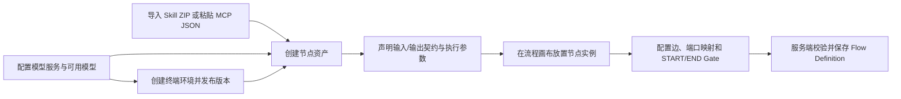
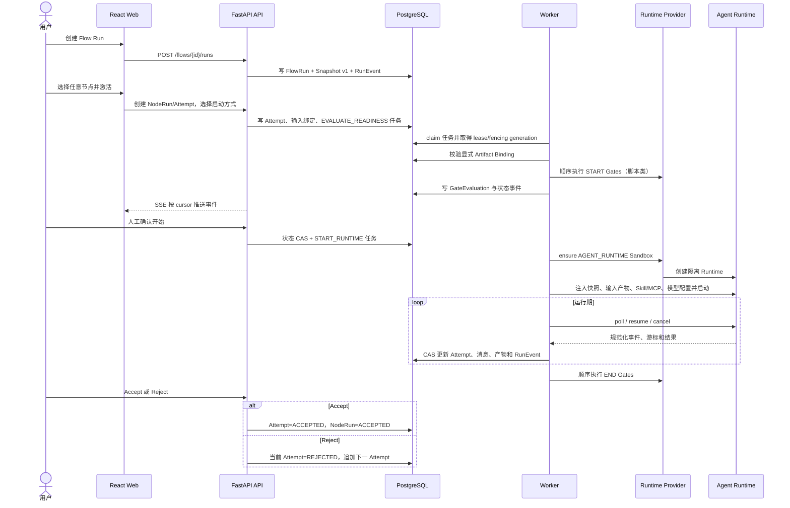
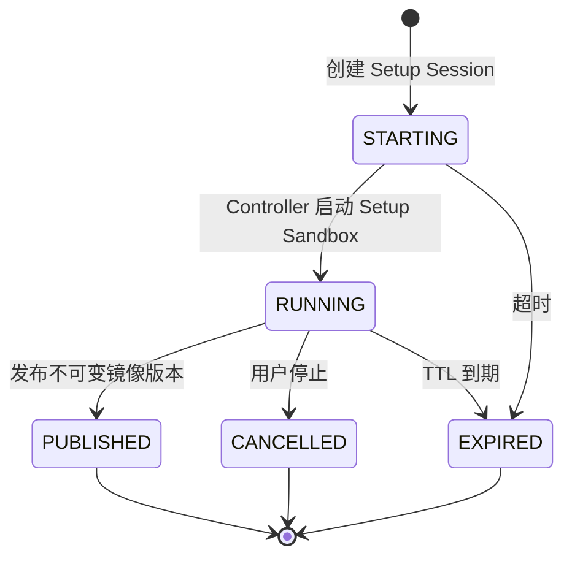
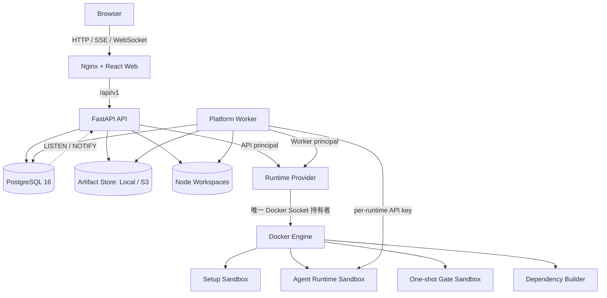
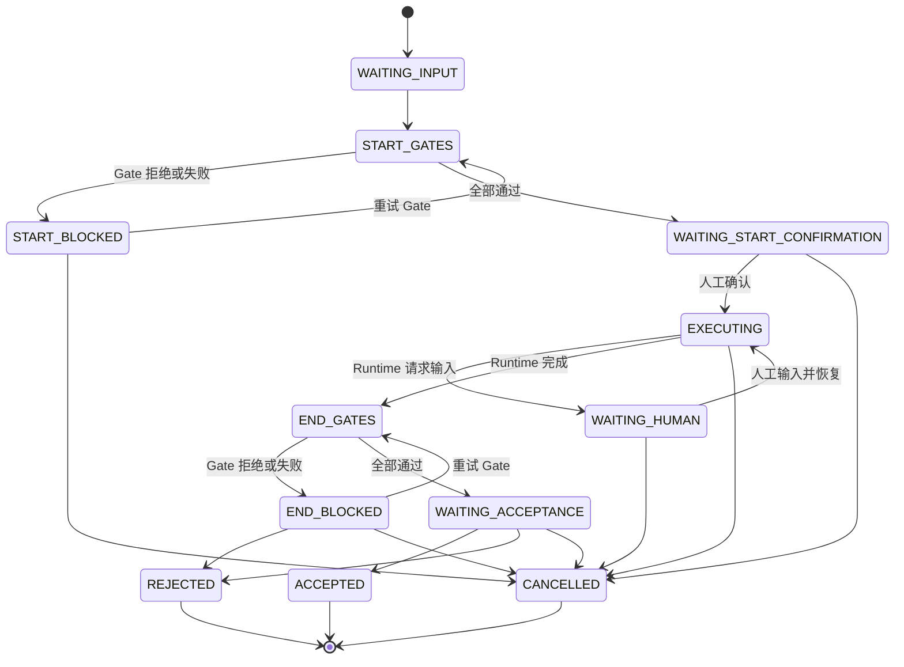
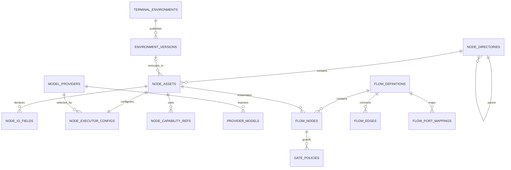
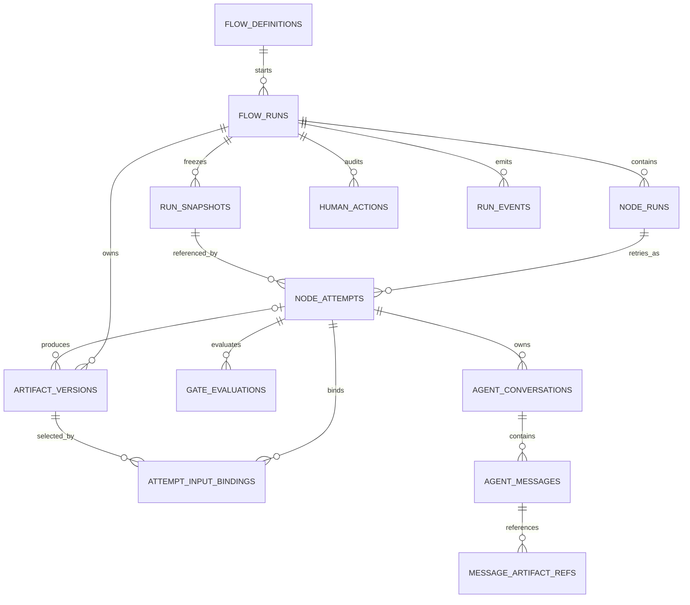
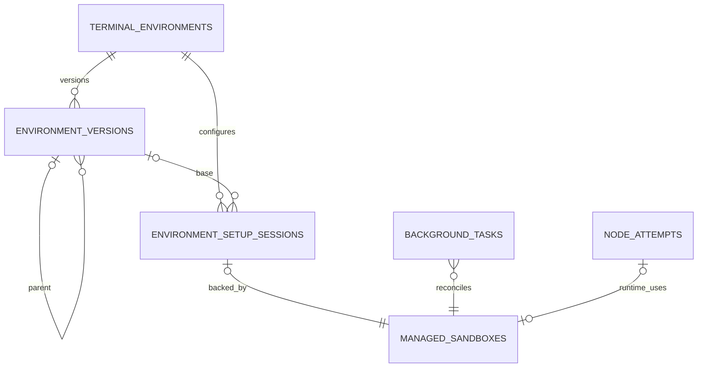
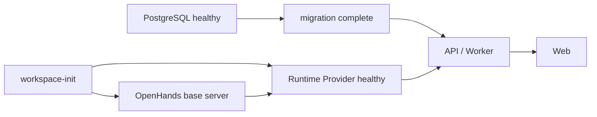
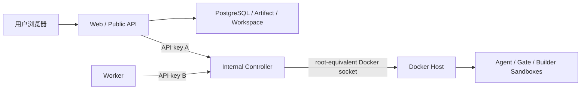

# FlowWeave 系统设计

> 本文依据 2026-08-10 当前工作区代码、Alembic 迁移 `0001`～`0018`、Compose 配置和跨进程契约整理。当前工作区包含未提交实现，因此本文描述的是工作区事实，不是最近一次 Git 提交的静态快照。若本文与早期 README 或设计稿冲突，以当前代码和迁移为准。

## 1. 文档目标与系统定位

FlowWeave 是面向内部研发流程的 Agent 工作台。系统把可复用的节点资产、模型、Skill/MCP、终端环境和流程拓扑组合为可审计的流程运行；Agent 负责执行，人工负责开始确认、过程补充、结果验收、退回修订、快照同步和流程终止。

核心设计目标：

1. **定义与运行解耦**：编辑态资产可以继续变化，已经开始的 Attempt 始终引用不可变 Run Snapshot。
2. **产物驱动**：节点输入绑定到明确的 Artifact Version；边只提供映射候选，不隐式触发节点。
3. **人工最终决策**：START Gate 通过后仍需人工确认，END Gate 通过后仍需人工验收。
4. **执行可恢复**：Runtime、Gate、对话投递和资源回收均由持久化任务驱动，Worker 重启后可以恢复。
5. **危险能力隔离**：API/Worker 不接触 Docker Socket，统一通过受认证的 Runtime Provider 使用固定高层操作。
6. **过程可追溯**：Attempt、Artifact、Binding、Gate Evaluation、Human Action 和 Run Event 形成追加式历史。

## 2. 业务边界与核心概念

| 概念 | 含义 | 关键约束 |
|---|---|---|
| Node Asset | 可复用节点定义 | 定义 I/O 契约、模型、提示词、能力和执行参数；可被多个 Flow Node 引用 |
| Capability | Skill 或 MCP | Skill 通过 ZIP 导入，MCP 通过页面内 JSON 创建；两者均使用校验/提交两阶段保存 |
| Terminal Environment | 可交互配置并发布的 Agent 环境 | 每次发布生成不可变 Environment Version；凭据卷按环境隔离 |
| Flow Definition | 可编辑流程定义 | 包含节点实例、边、端口映射和 Gate；同一 Node Asset 可多次放置 |
| Flow Run | 一次流程业务运行 | 创建时生成 Snapshot v1；可以从任意节点开始 |
| Run Snapshot | 流程定义的不可变快照 | 后续同步只追加新版本，旧 Attempt 不迁移 |
| Node Run | 某个流程节点的一次逻辑执行 | 退回不会覆盖它，而是在同一 Node Run 下新增 Attempt |
| Node Attempt | 一轮实际 Agent 执行 | 有独立状态、会话、Runtime、输入绑定和产物历史 |
| Artifact Version | 不可变产物版本 | 同一 `flow_run + field_key` 版本号递增；来源仅用于血缘审计 |
| Gate | START/END 阶段的检查策略 | 支持 Prompt、Python、JavaScript，按位置顺序执行 |
| Agent Conversation | Attempt 下的 Agent 会话 | 消息持久化、可排队/打断、可恢复轮询；终态 Attempt 只读 |
| Managed Sandbox | 动态容器的期望/观测状态台账 | 由 Worker 对账并回收孤儿、过期或请求删除的资源 |

### 2.1 必须保持的领域不变量

- Node Asset 是定义，Flow Node 是画布实例，两者不可混同。
- Flow Edge 和 Port Mapping 只表达候选数据关系；节点是否可执行只取决于该 Attempt 的显式 Input Binding 是否完整且类型匹配。
- Flow Run 的 Snapshot 不覆盖更新；每个 Attempt 固定引用创建它时的 Snapshot。
- Node Run 表达一次逻辑工作，Reject 后创建新 Attempt；历史 Attempt、产物和审计记录保留。
- START Gates 全部通过只进入 `WAITING_START_CONFIRMATION`，不会自动启动 Agent。
- END Gates 全部通过只进入 `WAITING_ACCEPTANCE`，不会自动接受结果。
- Runtime 不获得数据库凭据、模型密钥解密能力或 Docker Socket。模型连接信息由平台在执行边界按需注入。
- 平台不持久化 Lark OAuth 凭据；环境自己的 Lark CLI 状态保存在 Controller 管理的独立 Docker Volume，不进入镜像层、节点工作区或 Agent 消息。

## 3. 业务链路设计

### 3.1 设计态链路



1. **模型服务**：保存 Base URL、加密 API Key 和模型列表；节点只能引用启用的模型。被节点引用的模型不能直接禁用或删除。
2. **能力导入**：`validate` 先进行 Skill ZIP 或 MCP JSON 安全校验并生成短期导入记录，`commit` 再保存能力；到期临时对象由后台任务清理。
3. **终端环境**：用户创建 Setup Session，通过 WebSocket 终端安装工具或完成环境内授权，再发布为带 digest 的 Environment Version。
4. **节点资产**：绑定模型、环境版本、I/O Schema、提示词、超时、迭代次数以及能力引用。
5. **流程编排**：同一资产可形成多个不同 `instance_key` 的 Flow Node；端口映射独立于可视边保存，一个目标输入最多有一个映射候选。

### 3.2 流程运行主链路



运行步骤：

1. 创建 Flow Run 时冻结流程定义、节点配置、I/O、能力和 Gate，形成 `RunSnapshot(version=1)`。
2. 用户可以激活 Snapshot 中任意节点，系统创建 `NodeRun` 和首个 `NodeAttempt`。启动方式支持自动提示词、指定 Skill 或只创建会话后手动开始。
3. 人工上传/填写内容先登记为 Artifact Version，再通过 `AttemptInputBinding` 显式绑定到输入字段。
4. `EVALUATE_READINESS` 判定输入完备后进入 START Gates。脚本 Gate 通过一次性 Sandbox 执行，Prompt Gate 调用选定模型；结果写入 `GateEvaluation`。
5. START Gates 通过后等待人工确认。确认命令使用 `state_version` CAS，成功后投递 `START_RUNTIME`。
6. Worker 在事务外创建/调用 Runtime，并通过 `POLL_RUNTIME` 持续归一化事件。平台把输出登记为新的 Artifact Version，而不是覆盖已有内容。
7. Runtime 要求人工补充时进入 `WAITING_HUMAN`；用户输入形成 Human Action/Message，并由 `RESUME_RUNTIME` 恢复。
8. Runtime 完成后执行 END Gates，通过后等待验收。Accept 结束 Node Run；Reject 追加新 Attempt 并保留上一轮会话与产物。
9. 用户可激活其他节点并选择其输入产物版本。系统不会因为上游节点完成而隐式启动下游节点。
10. 用户显式完成或取消 Flow Run；取消先把业务运行置为终态，再由持久化 `CANCEL_RUNTIME` 任务确认活动 Runtime 已停止。
11. Agent Profile 切换必须先预览固定 Version/digest 的字段差异，再创建新的 Run Snapshot、NodeRun 与 Attempt；历史 Attempt 始终保留原 Profile。

### 3.3 Agent 对话链路

- 一个 Attempt 可有多个 Conversation，分为自动创建和人工创建；数量受配置限制。
- Message 保存来源、类型、投递状态、投递模式、Runtime 游标以及结构化 Capability 引用。
- `QUEUE_AFTER_TURN` 在当前 Agent turn 后投递；`INTERRUPT_AND_RESUME` 用于 steer。
- 发送、重试、取消排队、停止会话均先持久化意图，再交给 Worker 执行，避免 HTTP 连接中断导致命令丢失。
- Agent 输出中的工作区图片通过消息级接口读取；服务端把路径限制在该消息所属 Attempt 工作区，并校验图片类型，阻止路径穿越和跨 Attempt 读取。
- Conversation 终端通过 WebSocket 转发到受管 Runtime；Attempt 进入 `ACCEPTED/REJECTED/CANCELLED` 后，会话变为只读并异步清理 Runtime。
- 右侧治理面板区分瞬时 WebSocket 状态与 REST cursor/PostgreSQL 耐久事实，并展示 Fork provenance、Task usage、Critic/Goal 预算和只读 `ask_agent` 诊断。
- Browser、ACP、IDE/Desktop 和直接 Bash/File/Git/Workspace/Trajectory 操作没有授权产品入口；兼容矩阵只说明 `SKIP`/`UPSTREAM_BLOCKED`，不生成客户端假状态。

### 3.4 终端环境链路



1. Setup Session 选择环境基础镜像或已有 Environment Version。
2. API 经 Controller 创建 `ENVIRONMENT_SETUP` Managed Sandbox，并把终端字节流通过 WebSocket 双向转发。
3. 每个环境拥有独立凭据 Volume；Setup 容器可以在其中完成 Lark CLI 等本地授权。
4. 发布操作由 API 身份调用 Controller，将 Setup 容器提交为 `flowweave/environment-*` 镜像，记录 digest、父版本和 manifest；凭据 Volume 不进入镜像。
5. Node Asset/Flow Run 引用不可变 Environment Version。仍被节点、运行、Setup Session 或 Sandbox 引用的镜像版本禁止删除。
6. Setup 容器、环境镜像和凭据卷分别由幂等后台任务清理；Worker 会恢复失败但可重试的清理任务。

## 4. 逻辑架构设计



### 4.1 前端

- React 19 + TypeScript + Vite，生产由 Nginx 提供静态资源并反向代理 `/api`。
- TanStack Query 负责服务端数据，Zustand 仅保存当前视图和选中的 Run/NodeRun/Attempt/Conversation 等工作台状态。
- XYFlow 提供流程画布，xterm.js 提供 Setup/Agent 终端，Playwright 覆盖产品闭环。
- 前端不承担领域判定；状态迁移、引用约束、幂等和并发控制全部由服务端执行。

### 4.2 平台后端

后端是 Python 3.12/FastAPI/SQLAlchemy 2 async 应用，API 和 Worker 使用同一代码包、不同 Bootstrap 入口和独立 Container。模块采用 `domain/application/infrastructure/presentation/public.py` 分层，跨领域只能调用目标模块的 `public.py` facade。

| 模块 | 职责 |
|---|---|
| `catalog` | 节点目录、节点资产、I/O、执行配置、能力引用与两阶段导入 |
| `model_providers` | 模型服务、加密 API Key、模型发现与启停约束 |
| `environments` | 终端环境、Setup Session、版本发布与资源清理 |
| `flows` | 流程定义、节点实例、边、端口映射和 Gate 配置 |
| `runs` | Flow Run、Snapshot、Node Run/Attempt、Artifact、Binding、审计和 SSE |
| `orchestration` | Readiness、Gate、Runtime 生命周期、人工命令和状态 CAS |
| `conversations` | Conversation/Message、排队/steer/停止、Runtime 事件归一化 |
| `tasks` | Background Task、claim、lease、heartbeat、fencing、重试和 DEAD |
| `sandboxes` | Managed Sandbox 台账、期望状态和资源对账 |
| `gates` | Prompt/Python/JavaScript Gate 执行适配 |
| `runtime` | OpenHands/Mock Runtime Port、工作区和 Skill/MCP 注入 |
| `shared` | 数据库、UoW、ArtifactStore、Sandbox/Builder Port、错误和通用 Schema |

### 4.3 API 设计

- 公共接口统一位于 `/api/v1`；健康检查为 `/health`。
- 命令支持 `Idempotency-Key`；人工动作和后台任务也有数据库唯一幂等键。
- 错误格式统一为 `error.code/message/details/request_id`。
- Run Event 同时提供历史查询和 SSE；客户端携带 cursor/`Last-Event-ID` 可断点恢复。
- Setup Terminal、Conversation Terminal 使用 WebSocket；普通 Agent 对话消息仍通过持久化 HTTP 命令提交。
- Marketplace 目录预览只接受允许域名的无凭据 HTTPS URL 与完整 commit，在隔离 resolver 中读取 manifest；选择条目后另行解析实际 Plugin 来源并显式发布不可变 Version。
- Agent Profile 的版本历史、绑定、切换预览和切换命令均使用固定 Version ID/digest；切换只影响新 Snapshot/Attempt。
- OpenAPI v1、Run Event、Runtime Result、Gate Input/Result 和 Review Package 均有冻结契约或 JSON Schema。

### 4.4 Worker 与任务模型

`background_tasks` 同时承担任务队列和可恢复执行日志，当前处理器包括：

- 编排：`EVALUATE_READINESS`、`RUN_GATE_POLICY`、`START_RUNTIME`、`POLL_RUNTIME`、`RESUME_RUNTIME`、`CANCEL_RUNTIME`。
- 对话：`CREATE_CONVERSATION`、`DELIVER_CONVERSATION_MESSAGE`、`POLL_CONVERSATION`、`STOP_CONVERSATION_RUNTIME`、`CLEANUP_CONVERSATION_RUNTIME`。
- 环境：`CLEANUP_SETUP_CONTAINER`、`CLEANUP_ENVIRONMENT_IMAGE`、`CLEANUP_ENVIRONMENT_CREDENTIALS`。
- 能力：`CLEANUP_CAPABILITY_IMPORT`、`BUILD_CAPABILITY_DEPENDENCIES`。

Worker 使用 PostgreSQL `FOR UPDATE SKIP LOCKED` 竞争任务，并以 `lease_owner + lease_until + lease_generation` fencing。独立心跳事务续租；Handler 结果与任务 `SUCCEEDED` 在同一事务提交。若租约丢失，业务写入回滚，迟到结果不能覆盖新 Worker 的结果。Worker 启动时恢复过期任务、Runtime 投递、Conversation 任务和环境清理意图，并周期性执行 Setup 过期与 Sandbox 对账。

### 4.5 端口与适配器

- `RuntimePort`：OpenHands 为生产适配器，Mock 只用于测试。
- `ArtifactStorePort`：支持本地文件系统和 S3，提供临时写、finalize、read、exists、delete。
- `SandboxPort`：开发可使用进程适配器，Compose 使用 Docker/Controller。
- `DependencyBuilderPort`：关闭或使用隔离 Docker Builder。
- Docker 控制可为 local（仅 Controller）或 remote（API/Worker HTTP 客户端）。

## 5. 运行状态设计

### 5.1 Flow Run 与 Node Run

- Flow Run：`ACTIVE`、`WAITING_HUMAN`、`COMPLETED`、`FAILED`、`CANCELLED`。
- Node Run：`ACTIVE`、`ACCEPTED`、`CANCELLED`。
- Flow Run 是否完成由人工显式命令决定，不由图上的所有节点自动汇聚推断。

### 5.2 Attempt 状态机



`state_version` 是所有并发状态命令的 CAS 版本。Runtime 停止进度单独保存在 `runtime_phase`，取消业务状态与确认外部进程停止是两个阶段：`CANCELLING` → `CANCELLED`，重试耗尽则为 `CANCEL_FAILED`，可由专用 API 重新投递取消任务。

## 6. 数据设计

### 6.1 数据存储分工

| 存储 | 保存内容 | 一致性角色 |
|---|---|---|
| PostgreSQL 16 | 所有领域实体、状态、任务、事件、引用和资源台账 | 唯一业务事实源 |
| Artifact Store | 大产物、能力 ZIP、依赖 Bundle；本地或 S3 | 由数据库保存 storage key/hash/size；临时对象 finalize 后才可见 |
| Workspace | 节点长期文件、仓库、Skill/MCP 展开内容和 Attempt Session | Runtime 工作文件，不替代业务记录 |
| Docker Image | 已发布终端环境版本 | digest 锁定，数据库保存引用和 manifest |
| Docker Volume | PostgreSQL、OpenHands 状态、每环境凭据状态 | 生命周期由 Compose 或 Controller 管理 |

小于 `INLINE_ARTIFACT_LIMIT` 的文本产物可以内联到数据库；较大内容写 Artifact Store。外部对象写入采用“临时对象 → 短事务登记/CAS → finalize 或补偿删除”，避免长事务包裹文件/S3 I/O。

### 6.2 设计态实体关系



关键约束：目录内资产名唯一、Flow 内 `instance_key` 唯一、同一节点阶段的 Gate position 唯一、同一目标输入最多一个 Port Mapping、每个模型服务最多一个默认模型。Node Asset 和 Flow Definition 采用软删除，以保护历史运行引用。

### 6.3 运行态实体关系



核心唯一性与追加语义：

- `RunSnapshot(flow_run_id, version)` 唯一。
- `NodeRun(flow_run_id, sequence_no)` 唯一；同一个 Snapshot 节点可以按业务需要产生不同序号的 Node Run。
- `NodeAttempt(node_run_id, attempt_no)` 唯一。
- `ArtifactVersion(flow_run_id, field_key, version_no)` 唯一，内容至少存在 inline/URI/storage key 之一。
- `AttemptInputBinding(attempt_id, input_field_key)` 唯一，明确锁定一个 Artifact Version。
- `GateEvaluation(attempt_id, policy_snapshot_key, stage, evaluation_attempt)` 唯一。
- `HumanAction.idempotency_key` 和 `BackgroundTask.idempotency_key` 全局唯一。
- `RunEvent.cursor` 为全局递增 bigint，`flow_run_id + cursor` 建索引，支持顺序读取和断点续传。

### 6.4 环境、任务与资源台账



`ManagedSandbox` 以 `kind + owner_type + owner_id + generation` 唯一标识某代资源，并保存 `desired_state/observed_state`、确定性资源名、image、spec、活动时间、软/硬 TTL、下次对账时间和最后错误。删除通过期望状态单调推进，不能被迟到的 RUNNING 观察反转。

### 6.5 迁移策略

- `0001`～`0005`：Catalog、Flow、Run、Artifact、Execution 核心基线。
- `0006`～`0010`：能力导入、事件通知、Agent Conversation、Runtime 取消、独立端口映射。
- `0011`～`0013`：历史 OAuth/Lark 契约和惰性运行资源演进。
- `0014`～`0017`：终端环境、Run 环境引用、版本删除、Managed Sandbox 台账。
- `0018`：移除平台级凭据表和对应持久化边界。

Schema 只由独立 migration job 变更，API/Worker 启动时不自动迁移。当前生产路径只支持 PostgreSQL，不保留 SQLite 兼容分支。

## 7. 容器与部署设计

### 7.1 Compose 常驻/作业容器

| 服务 | 类型 | 端口/网络 | 数据与权限 |
|---|---|---|---|
| `workspace-init` | 一次性初始化作业 | 无网络依赖 | 初始化 artifact volume 和宿主 Workspace 目录权限 |
| `postgres` | 常驻 | 默认控制网；宿主默认 `127.0.0.1:55432` | `postgres-data` volume |
| `migration` | 一次性作业 | 默认控制网 | 等待 PostgreSQL 后执行 `alembic upgrade head` |
| `runtime-provider` | 常驻特权边界 | 仅 internal `docker-control` 网，容器内 8090 | 唯一挂载 Docker Socket；只读根、drop all caps、no-new-privileges |
| `api` | 常驻 | 默认网 + internal 控制网；宿主默认 `127.0.0.1:8080` | 非 root 10001；Artifact/Workspace；API Controller key |
| `worker` | 常驻 | 默认网 + internal 控制网 | 非 root 10001；Artifact/Workspace；独立 Worker Controller key |
| `web` | 常驻 | 宿主默认 `127.0.0.1:5173` | Nginx 静态站点/反向代理 |
| `dependency-builder-image` | 镜像就绪作业 | `network_mode: none` | 实际构建由 Controller 动态启动 |

默认网络 `flowweave_control` 承载 Web/API/Worker/PostgreSQL 等业务通信；`flowweave_docker_control` 是 internal 网络，仅 API、Worker 和 Controller 使用。Controller 不接入 Runtime 网络，也不对宿主发布端口。

### 7.2 动态容器

| 类型 | 创建主体 | 生命周期 | 网络/文件系统策略 |
|---|---|---|---|
| Environment Setup | API 经 Controller | 创建、交互、发布/取消/过期、清理 | 受管凭据卷；WebSocket 终端；不得把凭据提交进镜像 |
| FlowRun Agent Runtime | Worker 经 Runtime Provider | 每个 FlowRun 一个稳定 Session、一个 active generation；替换或显式删除 Run 时收口 | 每 Runtime 专属 bridge；`isolated` 或 `egress`；独立 API Key；外置 FlowRun Workspace 与 OpenHands state |
| Gate Sandbox | Worker 经 Controller | 单次 Gate 执行后销毁 | 禁网、非 root、只读根、cap-drop、no-new-privileges、资源限额 |
| Dependency Builder | Worker 经 Controller | 单次依赖构建后销毁 | 禁网或最小构建边界；产出 Bundle 进入 Artifact Store |

Runtime 网络模式由 Controller 配置决定，客户端请求不能升级权限：

- `isolated`：Docker internal 网络，Runtime 不直接出网。
- `egress`：允许通过 Docker NAT 访问模型服务、MCP 和工具；这不是域名白名单，生产仍需独立主机/VM、出口防火墙或受控代理。

每个 Runtime 使用 HMAC 从 Controller root key、manager scope 和资源名派生稳定的 `fwrt_*` 会话密钥，平台无需额外持久化 Runtime 密钥。Controller 用 Docker labels、资源 ID、scope、spec 签名和确定性名称共同校验所有权，避免误删或复用非本系统资源。

### 7.3 持久卷与 Workspace

```text
var/workspaces/
├── nodes/<node-asset-id>/
│   ├── skills/<capability-key>/
│   ├── files/
│   ├── repositories/
│   └── sessions/<run-id>/<node-run-id>/<attempt-no>/
└── .managed-assets/nodes/<node-asset-id>/
    ├── mcp/<capability-key>/
    └── hooks/<capability-key>/
```

- Workspace 由 API、Worker、OpenHands 基础服务和所属 Runtime 以约定路径共享。
- Runtime 只能可写挂载所属节点的工作区，不挂载数据库、Artifact 根或其他节点目录。MCP/Hook 上传资产从 `.managed-assets` 单独挂载到 `/runtime/capabilities`，并强制只读。
- Artifact 使用独立 named volume（或 S3），不会和 Runtime 工作目录混为一体。
- 每环境凭据 Volume 独立存在，由 Controller 创建/挂载/删除；删除前必须确认没有存活 Sandbox。

### 7.4 启动与依赖顺序



Compose 通过 healthcheck 和 `service_completed_successfully` 约束启动顺序。生产部署也应保留“先迁移、再滚动 API/Worker”的顺序，禁止多实例在启动钩子里并发改 Schema。

## 8. 一致性、并发与故障恢复

### 8.1 短事务原则

- HTTP 请求和 Worker 均使用显式 AsyncSession UoW。
- Docker、Runtime、模型 HTTP、Sandbox 和对象存储 I/O 不在数据库事务中等待。
- 典型协议为：短事务读取/冻结输入 → 事务外副作用 → 新短事务以 lease + state/version CAS 写回。
- Handler 业务结果和任务成功状态同事务提交；提交后动作和回滚补偿分别执行。

### 8.2 幂等与并发控制

- HTTP 命令：`Idempotency-Key`。
- 人工操作：`human_actions.idempotency_key`。
- 后台副作用：稳定的 `background_tasks.idempotency_key`。
- 编辑态并发：`row_version` 乐观锁。
- Attempt 状态：`state_version` + 当前 state/runtime phase CAS。
- Worker：lease generation fencing；过期 Worker 不可复活任务。
- 环境发布/删除和 Sandbox Reconcile：PostgreSQL advisory lock + 重新检查当前引用。

### 8.3 事件与前端恢复

Run Event 在业务事务内追加；PostgreSQL trigger 在提交后 `NOTIFY`。SSE Listener 收到通知后仍以数据库 cursor 为准批量补偿，因此通知丢失、API 重启或慢客户端不会造成历史缺口。生成器有批次上限、背压和空闲 heartbeat；前端重连携带最后 cursor。

### 8.4 Sandbox 对账

Worker 周期性取得按 manager scope 划分的 advisory lock：

1. 从数据库认领到期的 Managed Sandbox 批次。
2. 在事务外调用 Controller inspect/ensure/delete。
3. 在短事务内写 observed state；若期间收到删除请求，`desired_state=DELETED` 优先。
4. 列出带本 scope labels 的 Docker 资源，宽限期后回收数据库不存在的孤儿。
5. AGENT_RUNTIME 丢失不会无条件重建，以免伪造已丢失的会话状态；记录 `SANDBOX_RUNTIME_LOST` 等待人工处置。

### 8.5 失败分类

- 可重试任务进入 `RETRY`，按 `available_at` 再投递；超过 `max_attempts` 进入 `DEAD`。
- 资源所有权不匹配、镜像 tag 冲突等安全错误按永久失败处理，避免自动执行破坏性操作。
- Runtime 取消失败通过 `runtime_phase=CANCEL_FAILED` 显式暴露，业务 Attempt 已终态但资源停止状态仍可重试。
- Worker 启动恢复和周期维护会重新投递可恢复的 Runtime、Conversation 与环境清理工作。

## 9. 安全设计

### 9.1 信任边界



- Docker Socket 等价于宿主管理权限，仅 Controller 持有。Controller 不持有数据库 DSN、模型 API Key、OAuth Token 或业务 Artifact。
- API key A 与 Worker key B 必须不同且至少 32 字符。路由按主体 fail-closed 授权：API 只做 Setup/终端/发布，Worker 只做 Runtime/Gate/构建/回收。
- Controller 只在 internal 网络，不发布宿主端口；请求体有上限，scope 必须匹配。
- API/Worker/Controller 使用非 root 用户；Controller 自身只读根、删除 capabilities、启用 no-new-privileges 和 PID 限制。
- Gate/Builder/Runtime 视为不可信执行环境，使用镜像白名单、资源上限、只读根/临时盘、数值 UID/GID 和网络隔离。

### 9.2 密钥与凭据

- 模型 API Key 使用 Fernet 加密保存，API 只返回是否存在和尾号提示；生产必须配置 `CREDENTIALS_MASTER_KEY`。
- 模型密钥不进入 Run Snapshot、Prompt、Run Event 或 API 响应。Worker 只在调用 Runtime/Prompt Gate 时读取必要连接信息。
- `0018` 已移除平台级 OAuth 凭据存储；Lark CLI 等工具凭据属于终端环境私有 Volume。
- Runtime API key 按资源派生，避免单一共享 key 泄漏后横向访问其他 Runtime。

### 9.3 输入与文件安全

- Capability ZIP 限制压缩大小、展开大小、文件数、层级、单文件大小和扩展名；拒绝路径逃逸、绝对路径、符号链接、嵌套压缩及危险 YAML 结构。
- Skill/依赖 Bundle 展开时再次校验路径，目标文件使用原子写入和受控权限。
- Workspace 图片下载绑定 Message/Attempt，并验证规范化路径和媒体类型。
- Artifact Store key 和本地路径经过安全规范化；删除为幂等操作。

### 9.4 当前安全边界说明

当前公共 `/api/v1` 未实现终端用户身份认证、租户隔离或 RBAC，适合可信本地/内网部署，不应直接暴露到公网。生产化必须在入口补充统一认证授权、审计主体、TLS、速率限制和网络策略；这与 Controller 的内部 Bearer 认证不是同一层问题。

## 10. 可观测性与运维

当前可直接使用的观测面：

- `/health`：API/Controller 健康检查。
- `run_events` + SSE：业务状态、节点、Attempt 和 Runtime 事件流。
- `background_tasks`：任务状态、重试次数、租约、最后错误和 DEAD 任务。
- `managed_sandboxes`：期望/观测状态、TTL、清理次数和 Controller 错误。
- Conversation/Message：Agent 投递状态、Runtime cursor 和失败原因。
- Compose 容器日志：API、Worker、Controller、OpenHands 和 PostgreSQL。

建议生产接入结构化日志、request/task/run/attempt/resource 关联 ID、Prometheus 指标和告警。优先指标包括任务积压/DEAD 数、lease 丢失、SSE 延迟、Runtime 启动耗时、Gate 失败率、Sandbox 对账错误、Artifact finalize 失败和环境清理积压。

## 11. 性能与容量特征

- API 连接池默认 10，Worker 默认并发 4；任务租约默认 30 秒、心跳 10 秒。
- SSE 每批默认最多 100 条，heartbeat 默认 15 秒。
- Artifact 内联阈值默认 64 KiB，大内容进入 Artifact Store。
- 每 Attempt 默认最多 20 个 Conversation，单条消息默认最多 20,000 字符。
- Runtime 默认空闲 TTL 1 小时、硬 TTL 24 小时；Setup Session 默认 TTL 4 小时。
- 动态 Runtime/Gate/Builder 受 CPU、内存、PID、tmpfs 和存储上限约束；终端环境默认 2 CPU、2 GiB、512 PID。

当前任务队列和 SSE 依赖 PostgreSQL，适合单机/中小规模内部部署。横向扩展 API/Worker 不需要额外 Broker，但数据库将成为任务竞争、事件读取和状态写入的共同瓶颈，应通过任务延迟、锁等待、连接数和表膨胀数据决定是否拆分专用消息基础设施。

## 12. 测试与交付门禁

- 后端：Ruff format/lint、Pyright strict、PostgreSQL Pytest。
- 数据库：空库升级、回退核心基线、再次升级的 migration check。
- 契约：OpenAPI baseline、Run Event、Runtime、Gate 和 Artifact/Sandbox Port contract tests。
- 架构：模块边界、public facade、ORM 归属和禁止同步数据库路径。
- 前端：ESLint、TypeScript、Vite production build、Playwright E2E。
- 容器：Compose render/security check、平台镜像检查、经生产 Controller 路径的 Python/JavaScript Sandbox smoke。

常用命令：`make check`、`make migration-check`、`make platform-image-check`、`make sandbox-smoke`、`make e2e`。

## 13. 当前约束、已知偏差与演进建议

### 13.1 当前约束

1. 单 Compose/Docker Host 是主要部署形态；Controller 所在主机是高权限故障域。
2. 公共 API 没有终端用户认证、租户和 RBAC。
3. `egress` 只是开放 NAT，不提供域名级白名单、DLP 或细粒度出口审计。
4. PostgreSQL 同时承担业务库、任务队列和事件日志；高吞吐场景需要重新评估容量。
5. 本地 Artifact 与 Workspace 依赖共享文件系统；多主机部署应切换 S3，并为 Workspace 设计共享/同步策略。
6. Run 的节点推进由人工显式激活，不是自动 DAG Scheduler；这是当前产品语义，不应误判为缺陷。

### 13.2 文档与实现偏差

- 根 README 仍描述把宿主机 `~/.lark-cli` 挂入共享 OpenHands 会话；最新代码已改为“每终端环境独立的 Controller 管理凭据 Volume”，且 `0018` 删除平台凭据表。应以本文和 `docs/development.md` 的新路径为准，并更新 README。
- `docs/architecture.md` 仍是早期的极简图，没有表现 Terminal Environment、Managed Sandbox、Controller 双主体认证和动态 Runtime，应由本文替代为系统级说明。
- `docs/design-compliance.md` 的迁移文字仍以早期 `0001`～`0007` 为重点，当前实际 head 已到 `0018`。

### 13.3 推荐演进顺序

1. 先补齐入口认证、用户/组织/RBAC、操作主体审计和生产密钥管理。
2. 将 Controller 部署到独立 Docker 主机或受限 VM，增加 mTLS、出口代理和网络策略。
3. 增加结构化日志、指标、分布式追踪及 DEAD task/Sandbox 漂移告警。
4. 多实例部署前切换 S3 Artifact、明确 Workspace 共享语义，并进行 PostgreSQL/任务争抢压测。
5. 根据真实吞吐再决定是否把 Task Queue 或 Event Stream 从 PostgreSQL 拆出，避免过早引入额外一致性复杂度。
6. 统一 README、Architecture、Development 和 Compliance 文档，自动生成 API/表/迁移附录以减少漂移。

## 14. 代码与契约索引

| 主题 | 代码/配置入口 |
|---|---|
| API Bootstrap/DI | `services/platform/src/flowweave/bootstrap/api.py`、`container.py` |
| Worker/lease | `bootstrap/worker.py`、`modules/tasks/application` |
| 状态机/编排 | `modules/runs/domain`、`modules/orchestration/application/service.py` |
| 数据模型 | 各模块 `infrastructure/models.py` |
| Runtime | `runtime/base.py`、`runtime/openhands.py`、`runtime/workspace.py` |
| Runtime Provider | `bootstrap/runtime_provider.py`、`modules/sandboxes`、`shared/infrastructure/docker_*` |
| 终端环境 | `modules/environments` |
| 事件/SSE | `modules/runs/infrastructure/event_listener.py`、Run Router |
| 数据迁移 | `services/platform/migrations/versions` |
| 跨进程契约 | `contracts/*.schema.json`、`contracts/openapi-v1.json` |
| 部署 | `infra/compose.yaml`、各 Dockerfile、`.env.example` |
| 验证 | `Makefile`、`services/platform/tests`、`apps/web/e2e` |
